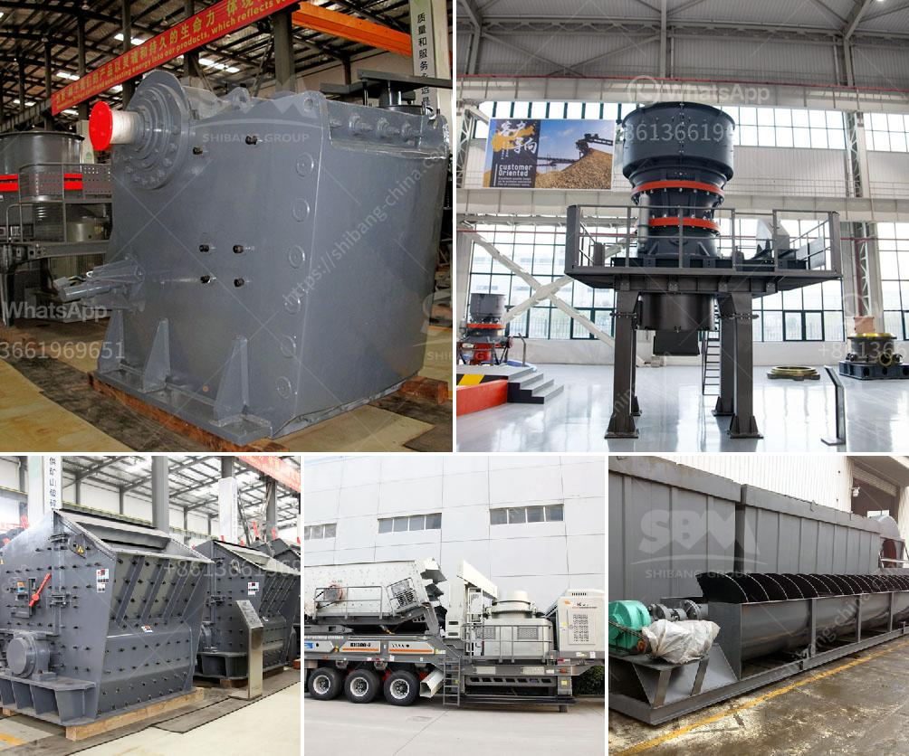

<h3>jaw stone crusher zimbabwe</h3>
The jaw stone crusher equipment is widely used in the mining industry, stone crushing industry, and the quarrying industry. For instance, it is essential in breaking huge rocks that are mined for various applications, especially in the construction industry. One of the key advantages of the jaw stone crusher Zimbabwe is its ability to crush large rocks into small pieces. This phenomenon is achieved by the two jaws of the crusher, reducing the size of the rocks as they pass through.

The jaw stone crusher is widely used in the mining and construction industry due to its great efficiency in every crushing task. It uses a compressive force to crush raw rocks, which are driven into the fixed and movable jaws. These jaws exert pressure on the rocks, breaking them down into smaller pieces to be further processed. The crushed stones are then used for various applications, such as building materials, road construction, and concrete aggregate.

In Zimbabwe, the jaw stone crusher is widely used in the primary crushing stage, and it is the ideal choice for rock crushing process. There are several types of jaw crushers available in the market, including compression, impact, and double toggle jaw crushers. They are used for different purposes, but all of them process hard and abrasive materials with ease.

One of the notable benefits of the jaw stone crusher Zimbabwe is its power saving ability. The jaw crusher consumes less energy compared to other crushing equipment. This is due to its mechanical motion that does not require electrical energy. It utilizes the reciprocating motion of two jaws to crush the rocks, significantly reducing energy consumption during the crushing process.

Another advantage of using the jaw stone crusher in Zimbabwe is its simplicity in design and operation. The jaw crusher does not have complex moving parts, which makes it easy to maintain and service. This saves time and effort for the operators, as they do not need to spend much time learning about the machine's intricate mechanisms. Additionally, the jaw stone crusher comes with a user-friendly interface, allowing operators to operate and control the machine with ease.

Moreover, the jaw stone crusher Zimbabwe has proven to be efficient in reducing material size before further processing. Therefore, it serves as a crucial machine in the crushing process, helping to increase productivity and reduce costs. It also ensures that the quality of crushed stones is maintained, as the jaw crusher produces consistent and uniform output.

In conclusion, the jaw stone crusher Zimbabwe offers several benefits, making it an essential machine in the mining and construction industry. Its power-saving ability, simple design, and easy operation make it a preferred choice for rock crushing applications. With the increasing demand for crushed stones in various sectors, the jaw stone crusher Zimbabwe plays a vital role in meeting these needs.
<h3>Contact us</h3><ul><li><strong>Whatsapp:&nbsp;<a href="https://wa.me/8613661969651">+8613661969651</a></strong></li><li><a href="https://swt.shibang-china.com/?git&amp;zhl&amp;jaw stone crusher zimbabwe"><strong>Online Service(chat now)</strong></a></li></ul><h3>Related</h3><ul><li><a href='stone crushing in pakistan.md'>stone crushing in pakistan</a></li><li><a href='ball mills machine.md'>ball mills machine</a></li><li><a href='three roller mill pakistan.md'>three roller mill pakistan</a></li><li><a href='limestone beneficiation.md'>limestone beneficiation</a></li><li><a href='cost of 500 tpd cement plant india.md'>cost of 500 tpd cement plant india</a></li></ul>