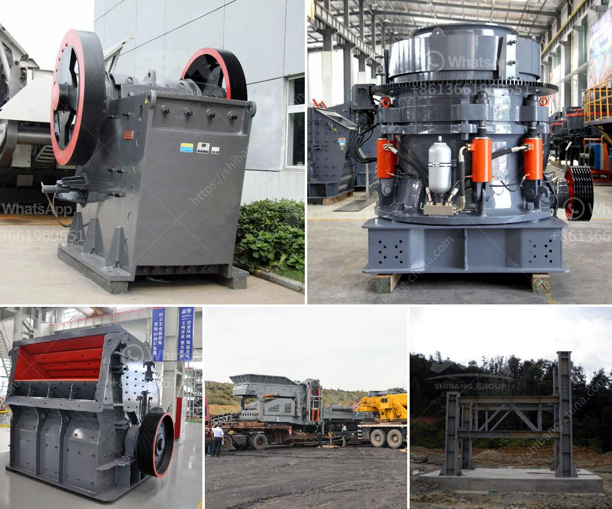

<h3>jual ball mill second</h3>
The ball mill is a type of grinding mill, widely used in pharmaceutical, chemical, and other industries. It operates by rotating on a horizontal axis, grinding materials to a predetermined size from coarse to fine. In certain applications, a ball mill is preferred over other methods such as the roller press or the vibratory disc mill due to its simplicity, versatility, and efficiency.

However, purchasing a brand-new ball mill can be costly, especially for small scale businesses or laboratories with budget restrictions. Thankfully, there is an alternative – jual ball mill second, or the sale of used ball mills. These second-hand machines are highly cost-effective and equally efficient as the new ones. This article aims to shed light on the benefits of purchasing a jual ball mill second and how it can enhance productivity and profitability for various industries.

One of the primary advantages of buying a second-hand ball mill is the potential for substantial cost savings. Used machines are typically available at a fraction of the original price, making them an attractive option for businesses looking to minimize expenses. This allows companies to allocate their resources to other essential areas or invest in additional equipment, ultimately boosting overall productivity.

Furthermore, purchasing a jual ball mill second allows for immediate availability. Unlike ordering a new ball mill, which often involves lead times and waiting for delivery, used machines are typically ready for use upon purchase. This eliminates any downtime and ensures a seamless transition for businesses in need of immediate grinding capabilities.

The availability of a wide range of second-hand ball mills also enables businesses to choose the most suitable option for their specific requirements. Different models and sizes allow for flexibility in terms of capacity, throughput, and particle size distribution. This ensures that businesses can find a jual ball mill second that perfectly matches their needs, without making any compromises on performance.

Contrary to common misconceptions, used ball mills are no less efficient or reliable than their brand-new counterparts. With proper maintenance and care, these machines can deliver the same level of performance and longevity as a new mill. Additionally, used ball mills have often been well-maintained by previous owners, ensuring their excellent working condition upon purchase.

It is important to note that when considering a jual ball mill second, potential buyers should conduct thorough inspections to ensure the machine's condition meets their requirements. Checking for signs of wear, reviewing maintenance records, and requesting a demonstration are essential steps to take before finalizing a purchase.

Overall, purchasing a jual ball mill second is a smart choice for businesses looking to enhance their grinding operations while minimizing costs. These used machines offer significant financial savings, immediate availability, and a wide range of options to suit different requirements. With proper inspection and maintenance, a second-hand ball mill can deliver optimal performance, ensuring increased productivity and profitability for various industries.
<h3>Contact us</h3><ul><li><strong>Whatsapp:&nbsp;<a href="https://wa.me/8613661969651">+8613661969651</a></strong></li><li><a href="https://swt.shibang-china.com/?git&amp;zhl&amp;jual ball mill second"><strong>Online Service(chat now)</strong></a></li></ul><h3>Related</h3><ul><li><a href='used vsi crusher for sale in india.md'>used vsi crusher for sale in india</a></li><li><a href='working principle of conveyor belt.md'>working principle of conveyor belt</a></li><li><a href='portable limestone crushing systems.md'>portable limestone crushing systems</a></li><li><a href='gypsum making machinery.md'>gypsum making machinery</a></li><li><a href='mobile stone crusher for sale.md'>mobile stone crusher for sale</a></li></ul>