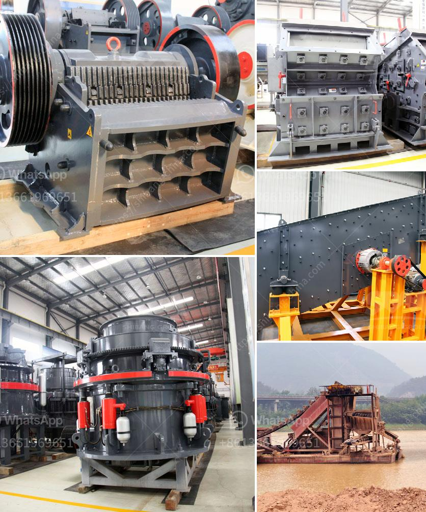

<h3>jual jaw crusher kenya</h3>
Quarrying industries in Kenya have embraced the use of the Jual jaw crusher Kenya, a necessary medium for quarrying purposes. Also known as the primary breaker, this is a machine that is used in mining, construction, water conservancy, road infrastructure, and metallurgy industries. Its application ranges from limestone to iron ore, gold ore, copper ore, and other mineral rocks. With a crushing ratio of up to 4-6 and the final product size ranging from 80-125mm, the Jual jaw crusher Kenya is a powerful and essential tool for anyone involved in the quarrying industry.

One of the main advantages of the Jual jaw crusher Kenya is its versatility. Its ability to crush a variety of materials, including different types of rock and ore, makes it a popular choice among quarry operators. This machine uses a compressive force to break down the material into smaller, more manageable sizes. The adjustable jaw height allows for easy regulation of the size of the final product, further enhancing its versatility.

Efficiency is another significant advantage of the Jual jaw crusher Kenya. Its high processing capacity reduces the time taken to complete crushing operations, allowing for more productivity and profitability in the quarrying industry. Additionally, the energy-efficient design of the machine minimizes power consumption, leading to lower operating costs. This makes the Jual jaw crusher Kenya a cost-effective investment for quarry operators looking to improve their bottom line.

Durability is also a critical feature of the Jual jaw crusher Kenya. The machine is built to withstand the tough conditions of the quarrying industry, including dusty environments and harsh weather conditions. Its robust construction and high-quality materials ensure that it can withstand heavy-duty use without compromising its performance. This durability guarantees a longer lifespan and reduces the need for frequent repairs or replacement, saving time and money for quarry operators.

Safety is paramount in any industrial setting, and the Jual jaw crusher Kenya prioritizes this aspect. It is equipped with safety devices such as a flywheel guard, a safety arm, and a safety belt, all designed to protect the operator while the machine is in operation. The advanced hydraulic system also ensures smooth and safe operation, minimizing the risk of accidents and injuries in the workplace. These safety features make the Jual jaw crusher Kenya a reliable and trusted tool for quarry operators.

In conclusion, the Jual jaw crusher Kenya is an indispensable machine in the quarrying industry. Its versatility, efficiency, durability, and safety features make it a valuable investment for any quarry operator. With its ability to crush a variety of materials and produce high-quality final products, this machine improves productivity and profitability in the quarrying sector. Moreover, its robust construction ensures a longer lifespan, reducing downtime and maintenance costs. By prioritizing safety, the Jual jaw crusher Kenya provides a secure working environment, ensuring the well-being of operators.
<h3>Contact us</h3><ul><li><strong>Whatsapp:&nbsp;<a href="https://wa.me/8613661969651">+8613661969651</a></strong></li><li><a href="https://swt.shibang-china.com/?git&amp;zhl&amp;jual jaw crusher kenya"><strong>Online Service(chat now)</strong></a></li></ul><h3>Related</h3><ul><li><a href='quarry crusher equipment manufacturer in germany.md'>quarry crusher equipment manufacturer in germany</a></li><li><a href='types of equipments used in cement industry.md'>types of equipments used in cement industry</a></li><li><a href='nigeria granite crushers.md'>nigeria granite crushers</a></li><li><a href='raymond mill mumbai and kolkata.md'>raymond mill mumbai and kolkata</a></li><li><a href='manganese ball milling machine.md'>manganese ball milling machine</a></li></ul>