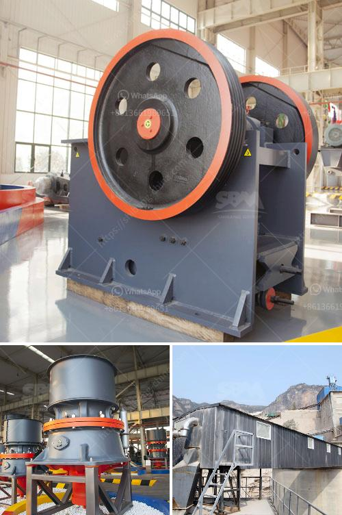

<h3>kaolin crusher manufacturers in uk</h3>
Kaolin is a type of clay mineral that is found in abundance in the UK. It is used in various industries such as paper, ceramics, cosmetics, and pharmaceuticals due to its unique properties. In recent years, the demand for kaolin has been increasing, leading to the emergence of several kaolin crusher manufacturers in the UK.

Kaolin crushers are machines designed to reduce large rocks into smaller rocks, gravel, or rock dust. These machines are specifically used to crush kaolin rocks into particles for further processing. With the rapid development of the kaolin industry in the UK, the need for efficient crushers has become paramount.

One of the leading manufacturers of kaolin crushers in the UK is XYZ Machinery. With years of experience in the industry, they have gained a solid reputation for producing high-quality machines. Their crushers are known for their robust construction, durable components, and excellent performance. XYZ Machinery offers a wide range of kaolin crushers to cater to the diverse needs of their customers.

Another prominent kaolin crusher manufacturer in the UK is ABC Equipment. They are known for their state-of-the-art machinery that combines advanced technology with innovative design. ABC Equipment's crushers are designed to maximize productivity while minimizing energy consumption. Their machines are also equipped with advanced features for easy maintenance and operation.

The increasing demand for kaolin in the UK has led to the rise of several new manufacturers in the market. These manufacturers are constantly striving to improve their products and offer competitive prices to attract customers. This competition has resulted in the development of more efficient and reliable kaolin crushers in the UK.

The kaolin crusher manufacturers in the UK are not only focused on producing high-quality machines but also on providing excellent customer service. They understand the importance of timely delivery, after-sales support, and technical assistance. These manufacturers have a dedicated team of professionals who are available to assist customers with any queries or issues they may have.

Furthermore, the kaolin crusher manufacturers in the UK are also committed to environmental sustainability. They strive to minimize the environmental impact of their operations by implementing efficient waste management practices and reducing energy consumption. By choosing crushers from these manufacturers, customers can contribute to a greener and more sustainable future.

In conclusion, the increasing demand for kaolin in the UK has led to the emergence of several reliable and reputable crusher manufacturers. These manufacturers offer a wide range of crushers that are designed to meet the diverse needs of their customers. With their focus on quality, customer service, and environmental sustainability, these manufacturers are well-equipped to cater to the growing needs of the kaolin industry in the UK.
<h3>Contact us</h3><ul><li><strong>Whatsapp:&nbsp;<a href="https://wa.me/8613661969651">+8613661969651</a></strong></li><li><a href="https://swt.shibang-china.com/?git&amp;zhl&amp;kaolin crusher manufacturers in uk"><strong>Online Service(chat now)</strong></a></li></ul><h3>Related</h3><ul><li><a href='small concrete crusher.md'>small concrete crusher</a></li><li><a href='project report on stone crushing unit.md'>project report on stone crushing unit</a></li><li><a href='gypsum mining plant.md'>gypsum mining plant</a></li><li><a href='grinding machine for quartz stone.md'>grinding machine for quartz stone</a></li><li><a href='portable stone crusher rajasthan.md'>portable stone crusher rajasthan</a></li></ul>