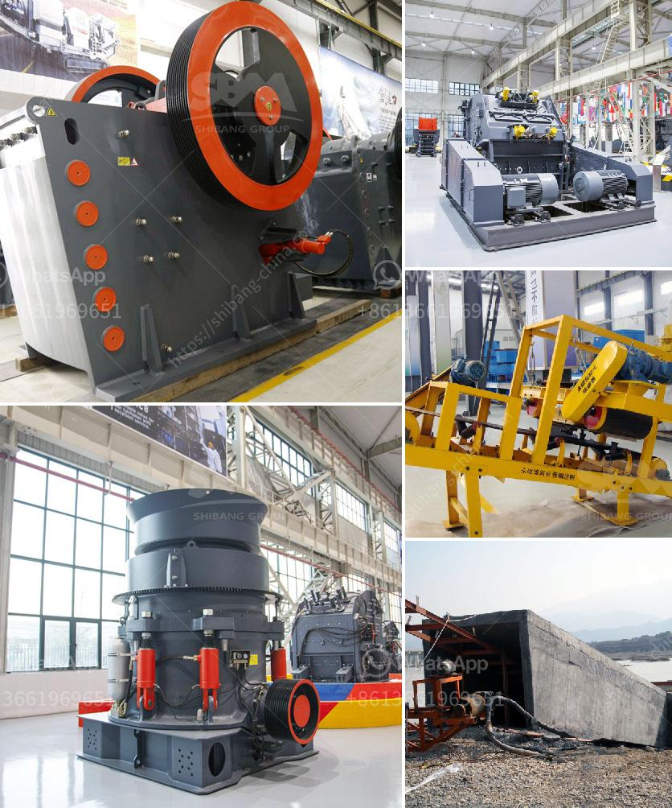

<h3>kaolin crusher price</h3>
Kaolin, a non-metallic mineral, is widely used in ceramics, paper, rubber, plastics and refractory industries due to its excellent physical and chemical properties. With the continuous demand for kaolin, the market is expanding. As a result, the kaolin crusher price has also increased.

As an essential equipment in the mining industry, the kaolin crusher is used for crushing materials into particles. It is mainly used to crush kaolin into small particles with various sizes. With the booming development of the kaolin market, more and more suppliers begin to increase investment in this field. Thus, the price of kaolin crusher has increased substantially.

However, the price of kaolin crusher is not determined by the supplier alone. The cost of raw materials, labor, transportation, and other factors will also affect the final price. In addition, different manufacturers have different production processes, technologies, and equipment, which also lead to variations in prices.

When choosing a kaolin crusher, consumers need to consider their own production needs and budget. It is recommended to compare the prices and qualities of different suppliers, and choose a reliable manufacturer with good feedback and reputation. By doing so, consumers can ensure the quality of the crusher and get a reasonable price.

In conclusion, the price of kaolin crusher is affected by multiple factors. As the demand for kaolin increases, the price is likely to continue to rise. Therefore, consumers should carefully consider their own needs, compare prices and qualities, and choose a reliable supplier to ensure the best value for their investment.
<h3>Contact us</h3><ul><li><strong>Whatsapp:&nbsp;<a href="https://wa.me/8613661969651">+8613661969651</a></strong></li><li><a href="https://swt.shibang-china.com/?git&amp;zhl&amp;kaolin crusher price"><strong>Online Service(chat now)</strong></a></li></ul><h3>Related</h3><ul><li><a href='fully mobile limestone crusher.md'>fully mobile limestone crusher</a></li><li><a href='grinding steel balls for mining.md'>grinding steel balls for mining</a></li><li><a href='list iron ore crusher plants in india.md'>list iron ore crusher plants in india</a></li><li><a href='bauxite crusher manufacturer.md'>bauxite crusher manufacturer</a></li><li><a href='feldspar ball mills manufacturers.md'>feldspar ball mills manufacturers</a></li></ul>