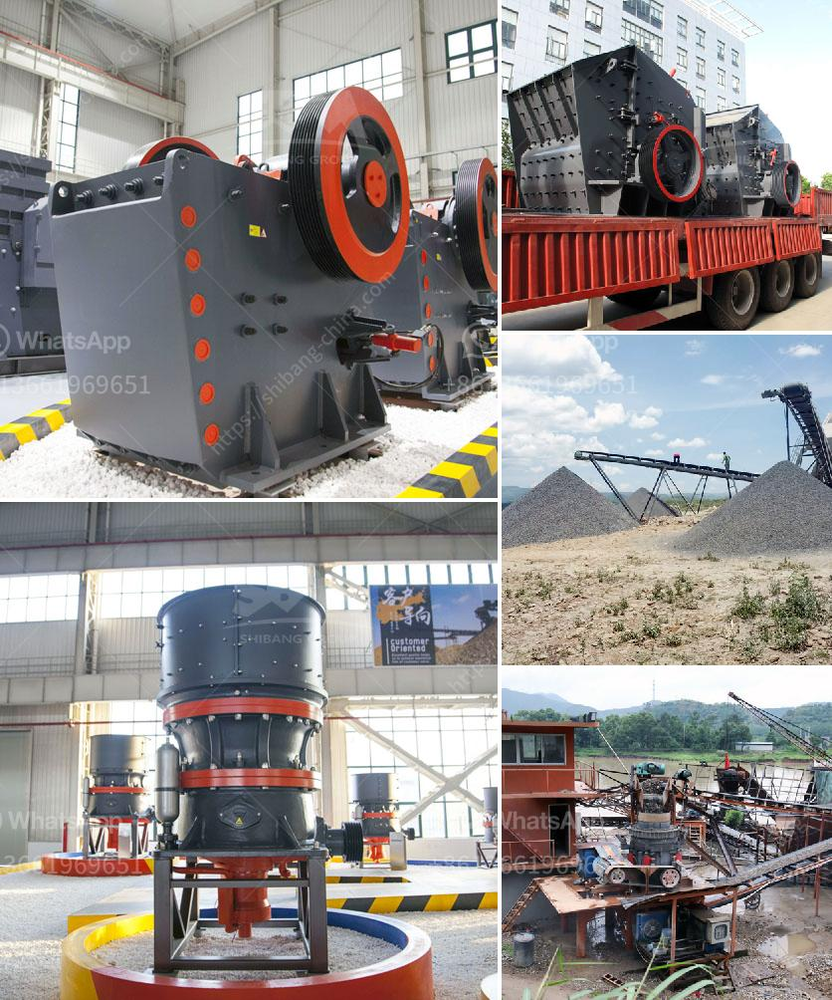

<h3>kaolin crusher processing in china</h3>
Kaolin, also known as china clay, is a white, soft, and plastic clay mineral extracted from the earth. It is widely used in various industries, including paper, ceramics, rubber, paint, and cosmetics. To process kaolin efficiently, a kaolin crusher is indispensable, and China is a major producer and consumer of kaolin.

In China, the kaolin industry has been developing rapidly in recent years. The country is the largest exporter of kaolin worldwide and holds a significant reserve of this mineral. The demand for kaolin products, such as those used in ceramics and paper production, has been steadily increasing, which drives the need for efficient processing methods.

The first step in the kaolin processing is crushing. It involves the use of a kaolin crusher, which reduces the size of the kaolin rocks from hundreds of millimeters to less than 25 millimeters. The crushed kaolin is then further refined by grinding, centrifuging, and magnetic separation. These processes help remove impurities and enhance the purity and brightness of the kaolin.

China has an extensive network of kaolin processing facilities, located mainly in the provinces of Jiangxi, Guangdong, and Guangxi. These facilities use advanced machinery and equipment to process kaolin efficiently. The crushers used in these facilities are designed to handle large quantities of kaolin and reduce them to the desired size for further processing.

One of the key players in China's kaolin crusher processing industry is Henan Hongxing Mining Machinery Co., Ltd. With more than 30 years of experience in the field, the company has a deep understanding of the kaolin market and the specific requirements of its customers.

Hongxing offers a range of kaolin crushers that are specifically designed for different applications. Their jaw crusher, impact crusher, and cone crusher models are widely used in the kaolin crushing process. These crushers are known for their high crushing efficiency, reliability, and low maintenance requirements.

In addition to their crushers, Hongxing also provides complete kaolin processing plants and auxiliary equipment. Their integrated solutions, comprising crushers, grinding mills, classifiers, and drying systems, enable customers to achieve high-quality kaolin products.

To cater to the varying needs of their customers, Hongxing offers customized solutions. They work closely with their clients to understand their specific requirements and provide tailored equipment and solutions accordingly. This customer-centric approach has earned them a reputation as a reliable and trusted partner in the kaolin processing industry.

The kaolin crusher processing industry in China is poised for further growth, driven by the increasing demand for kaolin products worldwide. With its expertise in kaolin processing and commitment to customer satisfaction, China's kaolin crusher processing industry is set to make significant contributions to the global kaolin market. As the leading producer and consumer of kaolin, China has the potential to shape the future of this industry.
<h3>Contact us</h3><ul><li><strong>Whatsapp:&nbsp;<a href="https://wa.me/8613661969651">+8613661969651</a></strong></li><li><a href="https://swt.shibang-china.com/?git&amp;zhl&amp;kaolin crusher processing in china"><strong>Online Service(chat now)</strong></a></li></ul><h3>Related</h3><ul><li><a href='sand washing machine in sri lanka.md'>sand washing machine in sri lanka</a></li><li><a href='vertical ball mill with price.md'>vertical ball mill with price</a></li><li><a href='impact crusher equipment manufacturer.md'>impact crusher equipment manufacturer</a></li><li><a href='list iron ore crusher plants in india.md'>list iron ore crusher plants in india</a></li><li><a href='price of jaw crusher germany.md'>price of jaw crusher germany</a></li></ul>