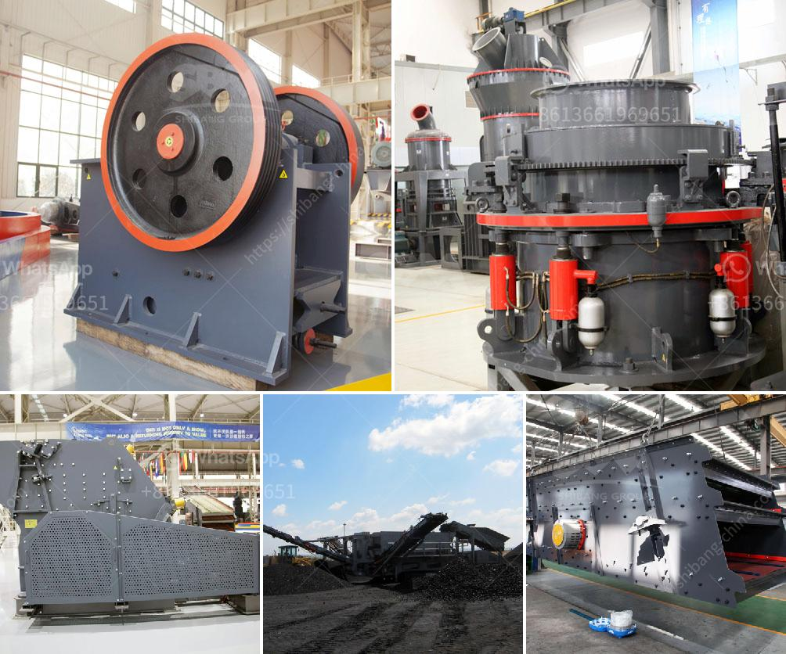

<h3>kaolin industry machine dhaka bangladesh</h3>
Dhaka, the bustling and rapidly developing capital city of Bangladesh, is home to a thriving industrial sector. Among the many industries that operate within Dhaka, the kaolin industry holds a significant position. Kaolin, also known as China clay, is a white mineral that is extensively used in various industrial applications such as ceramics, paper, paint, pharmaceuticals, and cosmetics.

The kaolin industry in Dhaka primarily consists of companies engaged in the extraction and processing of the mineral. These companies utilize specialized machinery and equipment to mine kaolin deposits and refine them into usable products. The machines used in the kaolin industry are designed to handle the extraction process efficiently and ensure optimum quality of the extracted material.

One of the key players in the kaolin industry in Dhaka is the Dhaka Kaolin Company, which has been operating for several decades. They are equipped with state-of-the-art machinery that enables them to extract kaolin deposits with high precision and efficiency. The company also invests in research and development to continuously improve their machines and processes.

The machines used in the kaolin industry in Dhaka are usually imported from countries known for their expertise in mining and mineral extraction. These machines are highly advanced and automated, ensuring a high degree of accuracy and reducing the need for manual labor. This not only increases production efficiency but also ensures the safety of workers involved in the mining process.

The kaolin industry in Dhaka has contributed significantly to the economic growth of the city and the country as a whole. It provides direct employment to a large number of individuals and supports various related industries such as transportation and packaging. Additionally, the kaolin industry plays a vital role in Bangladesh's export market, generating revenue through the export of kaolin products to international markets.

As the demand for kaolin continues to rise, the kaolin industry in Dhaka is expected to expand further. This growth will lead to more investments in advanced machinery and equipment, further improving the efficiency and productivity of the industry. Additionally, the industry is likely to drive innovation and technological advancements in the mining and extraction sector.

In conclusion, the kaolin industry in Dhaka, Bangladesh, is a thriving sector that contributes significantly to the country's economy. The industry relies on specialized machinery and equipment to extract and refine kaolin deposits, ensuring the efficient production of high-quality products. With the continuous growth and development of the industry, Dhaka is poised to become a prominent player in the global kaolin market.
<h3>Contact us</h3><ul><li><strong>Whatsapp:&nbsp;<a href="https://wa.me/8613661969651">+8613661969651</a></strong></li><li><a href="https://swt.shibang-china.com/?git&amp;zhl&amp;kaolin industry machine dhaka bangladesh"><strong>Online Service(chat now)</strong></a></li></ul><h3>Related</h3><ul><li><a href='stone crusher for agriculture.md'>stone crusher for agriculture</a></li><li><a href='stone jaw crusher.md'>stone jaw crusher</a></li><li><a href='sand and gravel crusher machine for sale philippines.md'>sand and gravel crusher machine for sale philippines</a></li><li><a href='bauxite beneficiation plant.md'>bauxite beneficiation plant</a></li><li><a href='crusher manufacturer in gujarat.md'>crusher manufacturer in gujarat</a></li></ul>