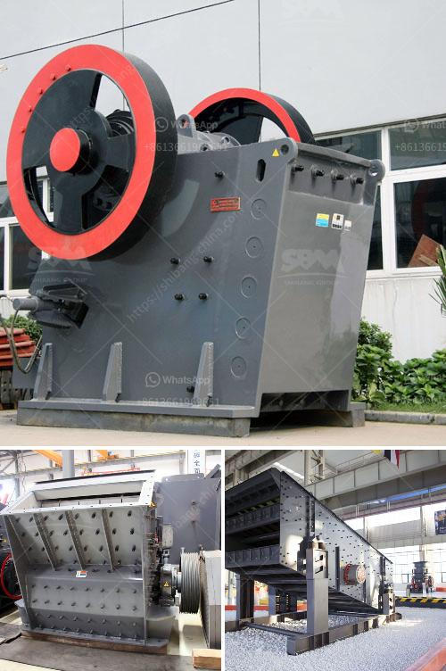

<h3>kaolin processing plant machinery</h3>
Kaolin is a clay mineral, part of the group of industrial minerals. Kaolin is called china clay, soft white clay that is an essential ingredient in the manufacture of china and porcelain and is widely used in the making of paper, rubber, paint, and many other products.

The kaolin processing plant machinery is designed with several functions into one unit. With advanced concepts of counter-attack in a ring road system, the kaolin processing plant machinery can handle materials with a side length of 100-500 mm, and its compressive strength can reach 350 MPa.

It has the advantages of large crushing ratio and cubic particles after crushing. The impact crusher has a shaping function. It is suitable for crushing medium-hard materials, such as limestone crushing in cement plants, with the advantages of large production capacity and small discharge particle size.

A variety of materials can be processed by this machine, such as gold ore, granite, marble, limestone, quartz stone, river pebble, iron ore, copper ore, etc. The following is a discussion of kaolin processing plant machinery based on the functions and applications of the machines:

As for the selection of kaolin processing plant machinery, experts suggest that customers can consider the following factors. Firstly, the technological parameters of the main machine, such as the determination of main engine power and determine the requirements of the motor. Secondly, customers should consider the price of the machine. Thirdly, they should consider the size requirements of the kaolin processing plant. Fourthly, the maintenance of the equipment is a vital factor to the plant’s running efficiency.

In order to meet the requirements of kaolin production, many companies have been given priority to with the de-pulping and screening equipment. The kaolin processing plant machinery will come into bin, crushing chamber, fan, analyzer, cyclone separator and micro powder collector. The size of the finished product produced by the kaolin processing plant machinery can be adjusted between 325-2500 mesh.

Optimization of the structure, its compact and modular design can make an overall space-saving layout, which greatly reduces the investment in equipment, construction costs, and time.

In terms of operation, it is safe and reliable, and the grinding roller is equipped with a unique sealing device, which can effectively prevent the leakage of fine powder, thereby ensuring the fineness and purity of the finished product.

The kaolin processing plant machinery is also energy-saving and environmental-friendly, with less dust, less noise, and less pollution. These features ensure the kaolin grinding mill can operate continuously and steadily.

Under the same finished final size and the same motor power, the capacity of ultrafine grinding mill is twice as much as jet mill, mixing grinder and ball mill.

The ring and roller are forged by special material with high utilization. Under the same grinding material and finish special size, the lifecycle of spare parts is about one year, which is 2-3 times longer than impact mill or turbo mill.
<h3>Contact us</h3><ul><li><strong>Whatsapp:&nbsp;<a href="https://wa.me/8613661969651">+8613661969651</a></strong></li><li><a href="https://swt.shibang-china.com/?git&amp;zhl&amp;kaolin processing plant machinery"><strong>Online Service(chat now)</strong></a></li></ul><h3>Related</h3><ul><li><a href='quartz ball mill manufacturer hyderabad.md'>quartz ball mill manufacturer hyderabad</a></li><li><a href='sand mills for manufacturing.md'>sand mills for manufacturing</a></li><li><a href='vibrating screen manufacturing process.md'>vibrating screen manufacturing process</a></li><li><a href='list iron ore crusher plants in india.md'>list iron ore crusher plants in india</a></li><li><a href='how much making limestone powder factory costs.md'>how much making limestone powder factory costs</a></li></ul>