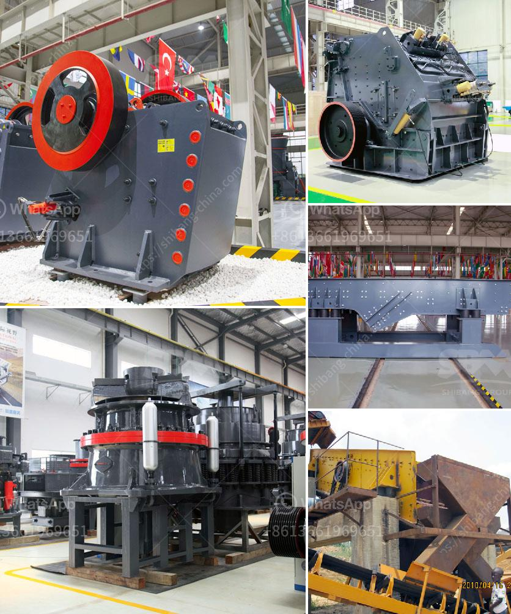

<h3>kenya cone crusher is manufactured</h3>
Kenya is a country with rich mineral resources, and there is immense potential for its mining industry to grow in the coming years. Cone crushers are a key piece of equipment in the mining industry. They are used to break down larger rocks into smaller, more manageable pieces that can be further processed. In recent years, Kenya has seen a rise in the demand for cone crushers, leading to the manufacturing and development of high-quality machines uniquely suited for the country's mining needs.

Cone crushers are widely used in various industries such as mining, construction, demolition, and recycling. They are designed to crush hard and abrasive materials efficiently and effectively. One of the leading manufacturers of cone crushers in Kenya is SBM, a global company specialized in the construction and mining industry.

SBM cone crushers are manufactured with state-of-the-art technology. These machines are durable, reliable, and efficient, offering a high level of performance in crushing operations. The company's cone crushers come in different models, each with varying features and capabilities to meet specific customer requirements.

The SBM cone crusher is designed with a unique combination of crushing chamber profile, eccentric throw, and high-efficiency crushing actions. This results in superior quality end products, with increased cubicity and reduced operating costs. The crushers are equipped with advanced hydraulic systems that enable easy and quick adjustment of the crusher settings.

One of the standout features of the SBM cone crushers is their versatility. They can be used for a wide range of applications, from primary crushing to final aggregate production. The machines are designed to handle both hard and soft rock materials, making them suitable for use in various mining and quarrying operations in Kenya.

In addition to their performance capabilities, SBM cone crushers also prioritize operator safety and convenience. The machines are equipped with features such as a fully hydraulic CSS (closed side setting) adjustment system, ensuring easy and precise control of the product size. The crushers also have automatic overload protection, reducing the risk of damage caused by uncrushable materials.

Maintenance and service of the SBM cone crushers are made easy through their user-friendly design. The machines are equipped with access doors and inspection hatches, allowing for quick and safe maintenance operations. Additionally, the crushers are designed to minimize downtime, with fewer wearing parts and a longer lifespan.

With the growing demand for cone crushers in Kenya, SBM is committed to providing high-quality machines that contribute to the country's development. The company's cone crushers are not only reliable and efficient but also environmentally friendly, with low emissions and noise levels.

In conclusion, cone crushers play a crucial role in the mining industry in Kenya. SBM, a leading manufacturer in the field, offers a range of high-quality cone crushers specifically designed to meet the country's unique mining needs. These machines offer superior performance, versatility, and safety, making them an ideal choice for crushing operations in Kenya. With SBM cone crushers, mining companies in Kenya can achieve high productivity and optimal end product quality.
<h3>Contact us</h3><ul><li><strong>Whatsapp:&nbsp;<a href="https://wa.me/8613661969651">+8613661969651</a></strong></li><li><a href="https://swt.shibang-china.com/?git&amp;zhl&amp;kenya cone crusher is manufactured"><strong>Online Service(chat now)</strong></a></li></ul><h3>Related</h3><ul><li><a href='aggregate roller crushing mill malaysia.md'>aggregate roller crushing mill malaysia</a></li><li><a href='crusher from china.md'>crusher from china</a></li><li><a href='ball mill for 15tphr capacity.md'>ball mill for 15tphr capacity</a></li><li><a href='limestone ore processing plant.md'>limestone ore processing plant</a></li><li><a href='quartz powder ball mill in tamilnadu.md'>quartz powder ball mill in tamilnadu</a></li></ul>