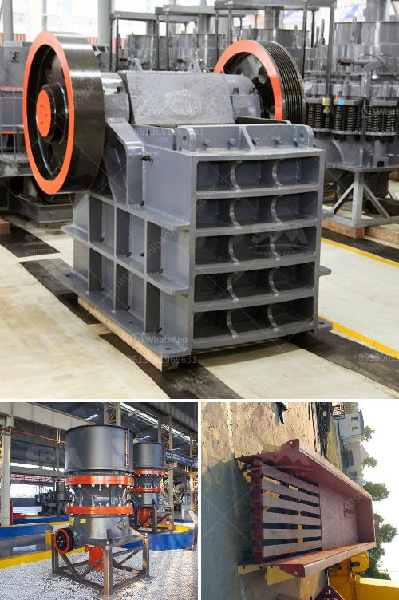

<h3>komatsu crawler jaw crusher</h3>
Komatsu is a leading manufacturer and supplier of construction and mining equipment, including the Komatsu crawler jaw crusher, which is a highly versatile machine that offers efficient and reliable performance. With a compact design and advanced features, the Komatsu crawler jaw crusher is an ideal solution for both the toughest construction and mining applications.

One of the key features of the Komatsu crawler jaw crusher is its ease of operation and maintenance. The crusher is equipped with an advanced PLC control system, which allows remote control and monitoring of the machine's performance. This ensures that operators can easily adjust the crusher's settings and track its productivity, leading to higher efficiency and reduced downtime.

The Komatsu crawler jaw crusher is also equipped with a unique hopper design that enables smooth material flow and prevents blockages. With a capacity of up to 480tph, the crusher can handle even the toughest rock and stone materials, making it suitable for a wide range of applications.

In addition, the Komatsu crawler jaw crusher is equipped with a powerful and fuel-efficient engine. The crusher's engine provides ample power for crushing and processing materials while also minimizing fuel consumption. This not only results in lower operating costs but also reduces the machine's environmental impact.

Furthermore, the Komatsu crawler jaw crusher features a durable and robust construction, ensuring long-lasting performance even in the harshest operating conditions. It is designed to withstand heavy-duty applications and is built to handle the toughest materials.

In conclusion, the Komatsu crawler jaw crusher is a reliable and efficient crushing solution that offers high performance and versatility. Its ease of operation and maintenance, powerful engine, and durable construction make it an excellent choice for construction and mining applications. With the ability to handle even the toughest materials, this machine delivers exceptional crushing results, ensuring maximum productivity and profitability for any project.
<h3>Contact us</h3><ul><li><strong>Whatsapp:&nbsp;<a href="https://wa.me/8613661969651">+8613661969651</a></strong></li><li><a href="https://swt.shibang-china.com/?git&amp;zhl&amp;komatsu crawler jaw crusher"><strong>Online Service(chat now)</strong></a></li></ul><h3>Related</h3><ul><li><a href='vibrating feeder for jaw crusher.md'>vibrating feeder for jaw crusher</a></li><li><a href='thailand for stone crusher plant.md'>thailand for stone crusher plant</a></li><li><a href='raymond mill for sale.md'>raymond mill for sale</a></li><li><a href='copper ore mining for sale in philippines.md'>copper ore mining for sale in philippines</a></li><li><a href='crusher from china price.md'>crusher from china price</a></li></ul>