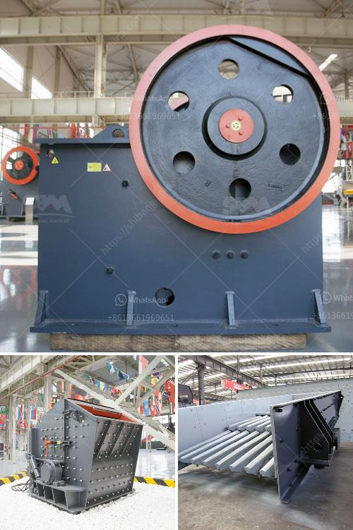

<h3>large jaw crusher for sale</h3>
The jaw crusher is a widely used crushing equipment of modern industries. It is often used in mining, metallurgy, construction, highway, railroad, and chemical industry. The jaw crusher has a large crushing capacity and a uniform product size. It is suitable for crushing large, hard, and abrasive materials with compressive strength less than 320MPa. The jaw crusher has a simple structure, reliable operation, and low operating costs.

As the demand for aggregates increases, the market for large jaw crushers is also expanding. Companies that specialize in mining and quarrying are constantly looking for durable equipment that can withstand the hefty workloads. A large jaw crusher enables the crushing of large rocks and hard materials, which significantly improves the production efficiency and reduces the overall cost. In addition, it greatly enhances the stability and durability of the equipment.

One of the prominent manufacturers that offer a wide range of jaw crushers is ___. They have a variety of models, including the PE series, PEW series, and HJ series jaw crushers. These jaw crushers are equipped with advanced features, such as hydraulic adjustment system, reliable toggle plate, and automatic lubrication system. The large jaw crushers offered by ___ have an inlet opening size ranging from 800mm to 1500mm, making them suitable for a wide range of applications.

The large jaw crusher for sale supplied by ___ is designed to crush tough rocks and materials, combining a high reduction ratio and increased capacity with any feed materials. This durability and performance-oriented design extends the lifespan of the equipment and ensures rock-solid operation. In addition to that, ___ offers a variety of jaw crusher accessories, such as toggle plates, toggle seats, and toggle blocks, which are specifically engineered for specific models to optimize performance and wear resistance.

When considering the purchase of a large jaw crusher, it is essential to conduct thorough research and choose a reliable manufacturer. ___ has earned a good reputation in the industry, providing cost-effective crushing solutions and excellent after-sales services. Their team of experts is always ready to assist customers in selecting the appropriate jaw crusher model and supporting equipment.

In conclusion, the large jaw crusher for sale is a key piece of equipment to help you achieve your production goals. With a substantial crushing capacity and high reduction ratio, it offers efficient crushing performance for various tough materials. Choosing the right manufacturer and model will ensure that the jaw crusher meets your requirements and delivers optimal results for your business. So, don't hesitate to invest in a reliable and durable large jaw crusher to elevate your crushing operations.
<h3>Contact us</h3><ul><li><strong>Whatsapp:&nbsp;<a href="https://wa.me/8613661969651">+8613661969651</a></strong></li><li><a href="https://swt.shibang-china.com/?git&amp;zhl&amp;large jaw crusher for sale"><strong>Online Service(chat now)</strong></a></li></ul><h3>Related</h3><ul><li><a href='stone crushers sale south africa.md'>stone crushers sale south africa</a></li><li><a href='granite mining business model.md'>granite mining business model</a></li><li><a href='stone crushers for sale usa.md'>stone crushers for sale usa</a></li><li><a href='machine of ultra fine mills.md'>machine of ultra fine mills</a></li><li><a href='sayaji crusher price.md'>sayaji crusher price</a></li></ul>