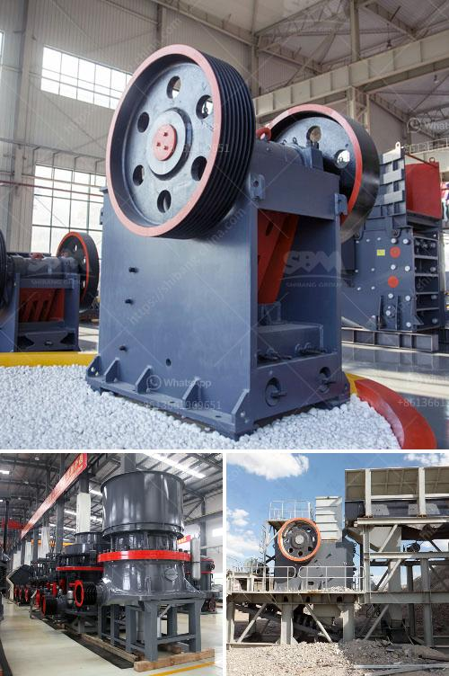

<h3>largest crusher manufacturing company</h3>
With the rapid development of infrastructure and real estate sectors, the demand for crushing machines is consistently on the rise. More investors are turning their attention towards the sector, eager to seize the opportunity to capitalize on the construction boom. In this article, we will explore the largest crusher manufacturing company in the world, encompassing a brief overview of their history and how they have evolved into an industry leader.

Established several decades ago, this renowned company has been a pioneer in the crusher manufacturing industry. With a focus on producing state-of-the-art crushing equipment, they provide clients worldwide with the most advanced and reliable equipment available. Through their tireless commitment to research and development, this company has continually raised the bar in terms of innovation and quality.

This manufacturing giant offers an extensive range of crushers, catering to various industries, including mining, construction, and recycling. Their cutting-edge technology ensures a superior crushing capability, whether it be for primary, secondary, or tertiary applications. From jaw crushers and cone crushers to impact crushers and gyratory crushers, their products are designed to efficiently process a wide range of materials.

Operating on a global scale, this company has established an extensive network of distributors and service centers worldwide. They are committed to providing exceptional customer support, ensuring that their equipment runs at optimal performance throughout its lifespan. With a strong market presence in numerous countries, they have solidified their reputation as a reliable and trusted partner in the crushing industry.

As the market leader, the company consistently invests in research and development to enhance their product range. They strive to stay ahead of the curve by incorporating the latest technological advancements, such as automation and artificial intelligence, into their machinery. Additionally, they are committed to sustainable practices, continually improving the energy efficiency of their crushers and minimizing their environmental impact.

When it comes to reliable, high-quality crushing equipment, the largest crusher manufacturing company is at the forefront of the industry. Their commitment to innovation, customer satisfaction, and sustainability has solidified their position as a global leader. With a diverse range of crushers and a comprehensive global support network, this industry titan is poised to continue setting new benchmarks in the crushing sector for years to come.
<h3>Contact us</h3><ul><li><strong>Whatsapp:&nbsp;<a href="https://wa.me/8613661969651">+8613661969651</a></strong></li><li><a href="https://swt.shibang-china.com/?git&amp;zhl&amp;largest crusher manufacturing company"><strong>Online Service(chat now)</strong></a></li></ul><h3>Related</h3><ul><li><a href='production of iron ore and manganese.md'>production of iron ore and manganese</a></li><li><a href='study on sand making machine in nigeria.md'>study on sand making machine in nigeria</a></li><li><a href='crushed stone products mwanza tanzania.md'>crushed stone products mwanza tanzania</a></li><li><a href='used crushers in germany for sale.md'>used crushers in germany for sale</a></li><li><a href='rock crusher dust fog control system philippines.md'>rock crusher dust fog control system philippines</a></li></ul>