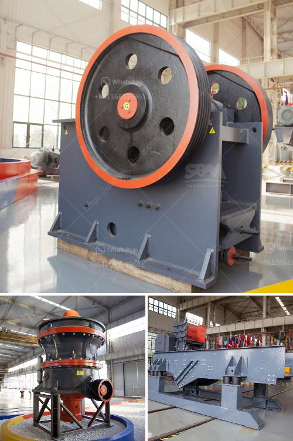

<h3>lavadoras de arenas y agregados</h3>
Las lavadoras de arenas y agregados son equipos esenciales en el proceso de trituración y clasificación de materiales en la industria de la construcción. Estas máquinas se utilizan para limpiar y separar partículas no deseadas de la arena y los agregados, lo que garantiza la calidad y uniformidad del material utilizado en proyectos de construcción.

El proceso de lavado de arena y agregados implica la introducción de los materiales a la lavadora, donde se agita y se somete a un flujo de agua. La combinación de la acción mecánica y química de la máquina ayuda a eliminar eficientemente impurezas orgánicas e inorgánicas, como arcilla, limo, polvo y partículas más pequeñas no deseadas.

Las lavadoras de arenas y agregados son especialmente útiles cuando se trabaja con materiales de cantera o río, ya que estos a menudo contienen partículas que pueden afectar la resistencia y la calidad del producto final. Además, estas máquinas permiten la recuperación y reutilización del agua utilizada en el proceso de lavado, lo que reduce el consumo de agua y contribuye a la sostenibilidad ambiental.

Hay diferentes tipos de lavadoras de arenas y agregados disponibles en el mercado, que varían en términos de su capacidad de procesamiento, tamaño y características técnicas. Al elegir una lavadora, es importante considerar las necesidades específicas del proyecto, como el tamaño del material a procesar y las tasas de producción requeridas.

En resumen, las lavadoras de arenas y agregados desempeñan un papel crucial en la industria de la construcción al garantizar la calidad y la uniformidad de los materiales utilizados. Estas máquinas ayudan a eliminar las impurezas no deseadas de la arena y los agregados, mejorando así la resistencia, la durabilidad y la estética de los productos finales. Además, el uso de lavadoras de arenas y agregados contribuye a la sostenibilidad ambiental al permitir la recuperación y reutilización del agua utilizada en el proceso de lavado.
<h3>Contact us</h3><ul><li><strong>Whatsapp:&nbsp;<a href="https://wa.me/8613661969651">+8613661969651</a></strong></li><li><a href="https://swt.shibang-china.com/?git&amp;zhl&amp;lavadoras de arenas y agregados"><strong>Online Service(chat now)</strong></a></li></ul><h3>Related</h3><ul><li><a href='china quartz sand dryer manufacturer.md'>china quartz sand dryer manufacturer</a></li><li><a href='cost of grinding machine.md'>cost of grinding machine</a></li><li><a href='project report on stone crushing unit.md'>project report on stone crushing unit</a></li><li><a href='jaw crusher supplier.md'>jaw crusher supplier</a></li><li><a href='cement making machines for factory.md'>cement making machines for factory</a></li></ul>