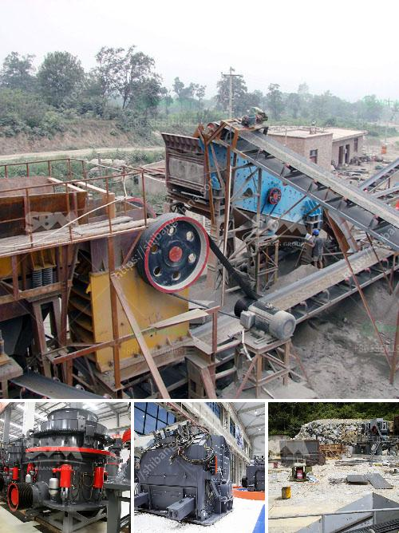

<h3>lay out calcium carbonate plant</h3>
Setting up a calcium carbonate plant requires careful planning and consideration. Calcium carbonate, also known as limestone, is a common mineral that is found in rocks and is an important component of many construction materials. It is used as a filler in industries such as paper, plastics, paints, and coatings, and also finds application in the agricultural sector.

When designing the layout for a calcium carbonate plant, several factors need to be taken into account. The first step is to determine the capacity of the plant, which will dictate the size and scale of the installation. This can vary depending on market demand and the scope of the intended production. A smaller plant may require less space and fewer resources, while a larger facility will need more acreage and investment.

Secondly, it is crucial to consider the location of the plant. Proximity to the source of raw materials, such as limestone quarries, is essential to reduce transportation costs. It is also essential to ensure easy access to utilities like water and electricity. A favorable location near a reliable power source and transportation infrastructure will help in the smooth operation of the plant.

The layout of the plant should be designed to optimize the production process. It usually begins with crushing and grinding the limestone rock into a fine powder. This process may involve multiple stages and equipment like crushers, mills, and classifiers. Consideration should be given to the arrangement of these machines to achieve efficient material flow and minimize downtime.

The plant should be equipped with appropriate storage facilities for storing both raw materials and finished products. Adequate storage space is essential to ensure continuous production and stock availability. Conveyors or other material handling systems are necessary to transport the materials from one process to another smoothly.

Additionally, the plant layout should also include space for quality control laboratories to test incoming raw materials and monitor the quality of the final product. Waste management facilities, like wastewater treatment plants or dust collection systems, should be incorporated to minimize the environmental impact of the operation.

In conclusion, the layout of a calcium carbonate plant needs to be carefully planned to ensure efficient production, smooth material flow, and adherence to environmental regulations. Factors such as plant capacity, location, and adequate infrastructure should be considered. A well-planned layout will not only optimize production processes but also contribute to the overall success and profitability of the plant.
<h3>Contact us</h3><ul><li><strong>Whatsapp:&nbsp;<a href="https://wa.me/8613661969651">+8613661969651</a></strong></li><li><a href="https://swt.shibang-china.com/?git&amp;zhl&amp;lay out calcium carbonate plant"><strong>Online Service(chat now)</strong></a></li></ul><h3>Related</h3><ul><li><a href='mineral processing calculations pdf.md'>mineral processing calculations pdf</a></li><li><a href='complete crushing for sale with price.md'>complete crushing for sale with price</a></li><li><a href='differences with gyratory crusher cone crusher.md'>differences with gyratory crusher cone crusher</a></li><li><a href='cement clinker manufacturing plant.md'>cement clinker manufacturing plant</a></li><li><a href='total gypsum mill production in india.md'>total gypsum mill production in india</a></li></ul>