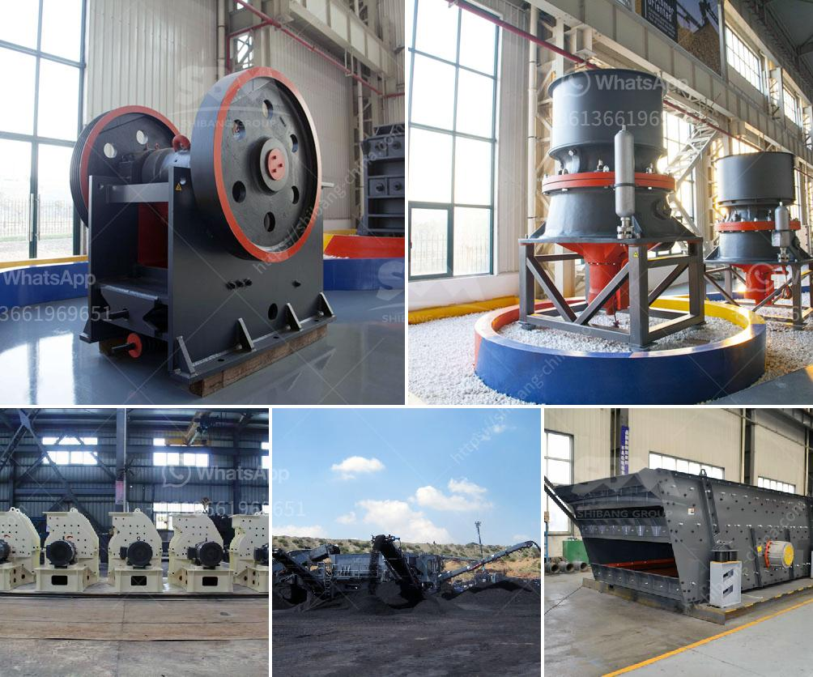

<h3>lime powder production equipment</h3>
Lime powder, also known as hydrated lime, is a versatile and affordable mineral that can be used in a wide range of applications. From agriculture to construction, lime powder plays a crucial role in many industries. To meet the growing demand for lime powder, companies around the world are investing in lime powder production equipment.

Lime powder production equipment is designed and manufactured to meet the needs of a variety of industries. With the advancement of technology, these machines are equipped with advanced features that enhance performance and efficiency. The production process of lime powder involves several steps, starting from the extraction of limestone and its pulverization into a fine powder.

One of the important aspects of lime powder production equipment is the kiln. The kiln is a high-temperature oven that transforms limestone into lime powder through a process called calcination. It is essential to choose a kiln that is reliable and efficient, ensuring consistent and high-quality lime powder production.

There are different types of kilns available for lime powder production, including rotary kilns and vertical kilns. Rotary kilns are commonly used in large-scale lime powder production plants. They allow for continuous operation, ensuring a steady supply of lime powder. These kilns are designed to withstand high temperatures and are equipped with systems that control temperature, airflow, and residence time to optimize the calcination process.

Vertical kilns, on the other hand, are suitable for smaller-scale lime powder production operations. They have a smaller footprint and are more energy-efficient compared to rotary kilns. Vertical kilns use a vertical shaft lined with refractory bricks to heat and calcine limestone. They offer flexibility in terms of feed size and can be easily adjusted to meet specific production requirements.

Apart from kilns, lime powder production equipment also includes crushers, mills, silos, and packing machines. Crushers are used to reduce the size of limestone rocks before they are fed into the kiln. Mills grind the crushed limestone into a fine powder, which is then transported to storage silos.

Storage silos are essential for storing large quantities of lime powder and ensuring a continuous supply for packaging and distribution. To package lime powder, companies use packing machines that accurately measure and fill bags with the desired quantity of lime powder. These machines are equipped with automated systems that minimize human error and ensure consistent packaging.

In conclusion, lime powder production equipment plays a vital role in meeting the growing demand for lime powder in various industries. Kilns, crushers, mills, silos, and packing machines are essential components of the production process, ensuring efficient and consistent production of high-quality lime powder. The choice of equipment depends on the scale of the operation and the specific requirements of the industry. Companies invest in reliable and advanced lime powder production equipment to optimize their production and deliver lime powder that meets the highest standards.
<h3>Contact us</h3><ul><li><strong>Whatsapp:&nbsp;<a href="https://wa.me/8613661969651">+8613661969651</a></strong></li><li><a href="https://swt.shibang-china.com/?git&amp;zhl&amp;lime powder production equipment"><strong>Online Service(chat now)</strong></a></li></ul><h3>Related</h3><ul><li><a href='price for cone crusher.md'>price for cone crusher</a></li><li><a href='limestone impact crusher.md'>limestone impact crusher</a></li><li><a href='concrete crusher hire nigeria.md'>concrete crusher hire nigeria</a></li><li><a href='list iron ore crusher plants in india.md'>list iron ore crusher plants in india</a></li><li><a href='dolomite crushing machine mill.md'>dolomite crushing machine mill</a></li></ul>