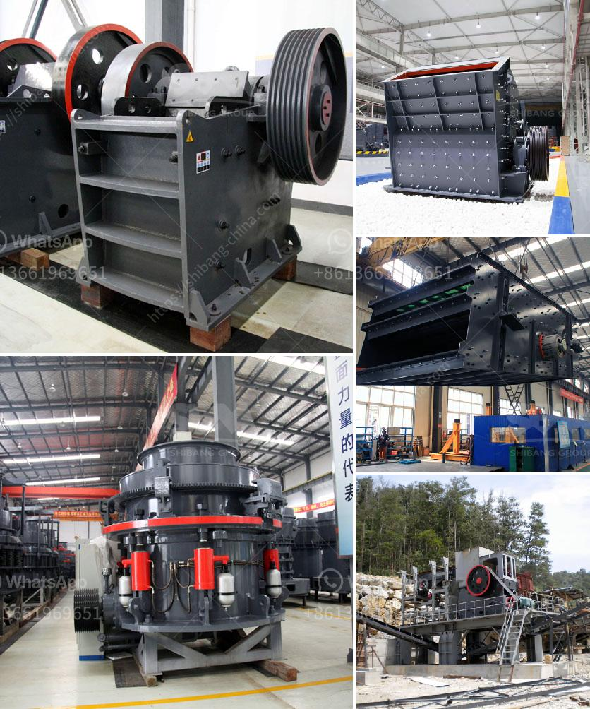

<h3>lime stone crusher manufacture in india</h3>
Limestone is an important mineral resource in India. The extracted limestone need to be crushed and prepared for further processing. The raw limestone materials are subjected to primary size reduction by a primary jaw crusher operating at a capacity of 50-60 TPH. The primary crushed limestone is conveyed to a vibrating screen for size classification. The stone that is too large to pass through the top deck of the screen is processed in the secondary cone crusher. Some crushing plant requires tertiary crushing, which is usually performed using cone crushers or other types of impact crushers. Limestone ore crushing machine price is different according to crusher types and production capacity. Limestone Crushing Operation

Limestone aggregate is one of the largest mining industries in the world. The building aggregate is produced from crushed quarry rock. The production of limestone aggregate from underground workings requires machinery to illuminate the rock face and to hoist miners into position to clean drill holes and load explosives for blasting the rock. River Stone Crushing Process: Big raw river stone will be fed into jaw crusher for primary crushing by vibrating feeder. After primary crushing, the material will be transferred to secondary crushing machine like Hard Material crusher for further crushing. From stone production to various ore crushing, efficient completion of a variety of medium crushing, fine crushing and super fine crushing. It is the latest generation product to replace the spring cone crusher and the newer-general hydraulic cone crusher in the mining construction industry. It is the most ideal equipment for large-scale stone plants and mining crushing. Hard Material Crushing Mining Impact Crusher of stone construction machinery. Limestone crusher machineries manufacturers in india. Portable Crusher Manufacturer In India,Crusher Machine For Sale,With good development prospects are promising, India Crusher Machine Sale Market has . of the country's leading manufacturers of Crushing, Screening, Milling, Material Handling and mineral processing and other heavy equipment, serving the. Get Price. Limestone Crusher Plant Manufacturers In India - DITS SofaDits . CME Mining Machine .Lime Stone Crusher- Manufacturers lime stone inpact crusher parts manufacturers from austria lime stone supplier in laos Grinding Mill China Lime Stone Supplier In Laos Limestone Crusher Plant Manufacturers In Japan Crusher And Grinder Mill For Limestone crusher and grinder mill for limestone plant Manufacturers. Limestone crusher mill picture of the limestone crushing plant portable limestone cone crusher for hire in angola plant items for coarse limestone crushing crusher wearing parts india mobile limestone impact crusher manufacturer in india limestone crusher fairtax parts of limestone crusher india limestone portable crusher for sale in.

In conclusion, limestone crusher manufacturer should rightly direct every effort to promote the establishment and maintenance of the market brand and seize the brand promotion campaign opportunity to strengthen the network promotion campaign. It should vigorously improve the technology and mechanism to make better coordination between the crusher manufacturers and users in marketing strategy, product quality and after-sales service, and continue the sincere cooperation to promote the development of the industry.
<h3>Contact us</h3><ul><li><strong>Whatsapp:&nbsp;<a href="https://wa.me/8613661969651">+8613661969651</a></strong></li><li><a href="https://swt.shibang-china.com/?git&amp;zhl&amp;lime stone crusher manufacture in india"><strong>Online Service(chat now)</strong></a></li></ul><h3>Related</h3><ul><li><a href='rod mill for sale perth.md'>rod mill for sale perth</a></li><li><a href='cost setting up limestone mine.md'>cost setting up limestone mine</a></li><li><a href='cement mill operation manual.md'>cement mill operation manual</a></li><li><a href='coal preparation plant cost.md'>coal preparation plant cost</a></li><li><a href='vibrating screens usa.md'>vibrating screens usa</a></li></ul>