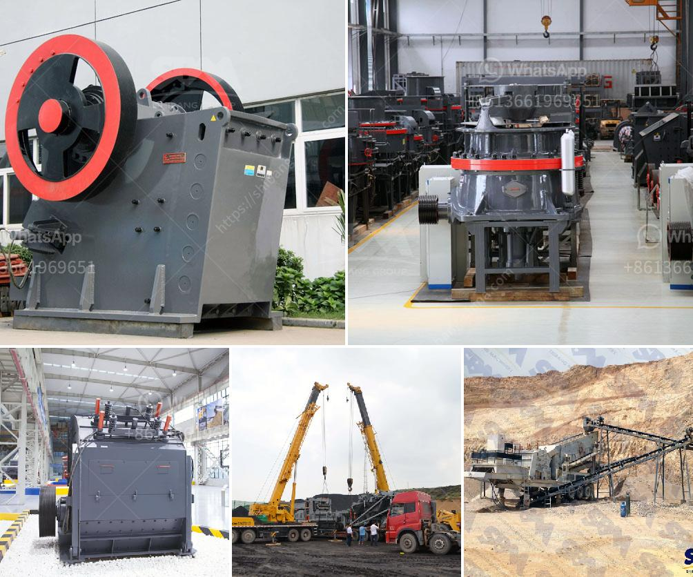

<h3>lime stone grinder machine price in india</h3>
Limestone is a sedimentary rock, composed mainly of calcium carbonate (CaCO3), usually in the form of calcite or aragonite. It is a common raw material for the manufacturing of cement, building materials, and even as a soil conditioner. Limestone can be processed by various crushing and grinding methods to obtain the desired particle size, and this process is usually carried out using limestone grinding machines.

In India, limestone mining is pursued mainly for cement production, which is a vital ingredient for the construction industry. With the growing infrastructure development in the country, the demand for limestone has skyrocketed. This has led to an increase in the number of limestone grinder machines available in the Indian market.

The price of a limestone grinder machine in India varies depending on the size, capacity, and features of the machine. The range starts from a few thousand rupees and goes up to lakhs of rupees. Some of the popular limestone grinder machine brands in India include Bosch, Dewalt, and Makita. These brands offer a wide range of machines with different capacities and power ratings to cater to different customer requirements.

When considering the price of a limestone grinder machine, it is important to look beyond just the initial cost. Factors such as durability, maintenance cost, availability of spare parts, and after-sales service should also be considered. It is advisable to do thorough research and compare prices from different brands and suppliers before making a purchase decision.

In conclusion, the price of a limestone grinder machine in India can vary depending on several factors. As limestone is an essential raw material for various industries, the demand for grinder machines is high. It is important to consider not only the price but also the quality, durability, and after-sales support when purchasing a limestone grinder machine in India.
<h3>Contact us</h3><ul><li><strong>Whatsapp:&nbsp;<a href="https://wa.me/8613661969651">+8613661969651</a></strong></li><li><a href="https://swt.shibang-china.com/?git&amp;zhl&amp;lime stone grinder machine price in india"><strong>Online Service(chat now)</strong></a></li></ul><h3>Related</h3><ul><li><a href='hammer mills semarang.md'>hammer mills semarang</a></li><li><a href='calcium carbonate plant sell in india.md'>calcium carbonate plant sell in india</a></li><li><a href='industrial impact crusher.md'>industrial impact crusher</a></li><li><a href='manganese mobile processing plants.md'>manganese mobile processing plants</a></li><li><a href='coal processing plants south africa.md'>coal processing plants south africa</a></li></ul>