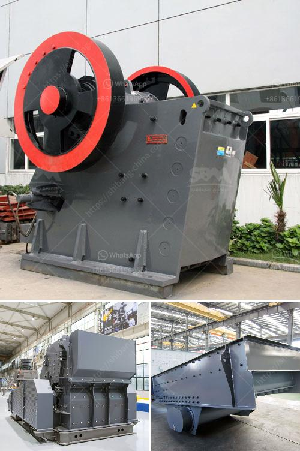

<h3>limestone ball mill italy</h3>
Limestone is a sedimentary rock, composed mainly of calcium carbonate (CaCO3), usually in the form of calcite or aragonite. It is a raw material widely used in building materials, cement, metallurgy, mining and other industries. In recent years, with the gradual acceleration of industrialization and infrastructure construction, the demand for limestone powder is increasing, which has promoted the development of limestone mining industry.

Limestone ball mill is a versatile grinding mill and has a wide range of applications. The mill can vary in size from small batch mills up to mills with outputs of hundreds of tonnes per hour. They are the most widely used of all mills. Small hand operated ball mills are used in Bolivia for preparation of ore, sand and gravel. Limestone ball mill consists of a cylindrical drum, sometimes tapered at one end, and usually has a charge of steel balls (up to 40% by volume) ranging in size up to 125mm for larger mills.

Product size can be as small as 0.005mm, but product size is dependant upon the time the charge spends in the grinding zone and therefore the reduction rate is a function of the throughput. Ball mills with a drum length to diameter ratio greater than 1.5 are referred to as tube mills. Ball mills may be primary or secondary grinders. Primary grinders are fed from crushers such as a jaw crusher. Secondary grinders are fed from other grinders e.g. a rod mill. Ball mills are usually either of the grate (diaphragm) or overflow type.

- Inlet – crushed ore is fed to the ball mill through the inlet. A scoop ensures the feed is constant.

- Ball mills may be lnear or cylindriCal in shape, and can alSo be aDapted With almoSt any drivinG devic'.

Limestone ball mill is an effective grinding machine for grinding various materials into powder. The Ball Mill is used to grind many kinds of mine and other materials, or to select the mine. It is widely used in building material, chemical industry, etc. There are two ways of grinding: the dry process and the wet process. It can be divided into tabular type and flowing type according to different forms of discharging material.

In Italy, limestone ball mills are widely used for quarrying and mining industry. The limestone ball mill is designed with the advanced equipment concept of foreign countries, which makes the ball milling stable for a long time. The main thing is to make the steel ball natural grading, to achieve zero risk of gas cooling, and no leakage. It is very popular among users and there are many manufacturers. Therefore, in the market, the competition among manufacturers of limestone ball mills is fierce, and the price of equipment is also in the range of the user's budget.

In summary, the limestone ball mill is indispensable equipment for mining and cement production. The limestone ball mill is designed with the advanced equipment concept of foreign countries, which makes the ball milling stable for a long time. The main thing is to make the steel ball natural grading, to achieve zero risk of gas cooling, and no leakage. It is very popular among users and there are many manufacturers. Therefore, in the market, the competition among manufacturers of limestone ball mills is fierce, and the price of equipment is also in the range of the user's budget.
<h3>Contact us</h3><ul><li><strong>Whatsapp:&nbsp;<a href="https://wa.me/8613661969651">+8613661969651</a></strong></li><li><a href="https://swt.shibang-china.com/?git&amp;zhl&amp;limestone ball mill italy"><strong>Online Service(chat now)</strong></a></li></ul><h3>Related</h3><ul><li><a href='hammer mills for mining.md'>hammer mills for mining</a></li><li><a href='bentonite powder making.md'>bentonite powder making</a></li><li><a href='almond sand stone crusher price.md'>almond sand stone crusher price</a></li><li><a href='bentonite powder plant in surat.md'>bentonite powder plant in surat</a></li><li><a href='horizontal grinding mills price.md'>horizontal grinding mills price</a></li></ul>