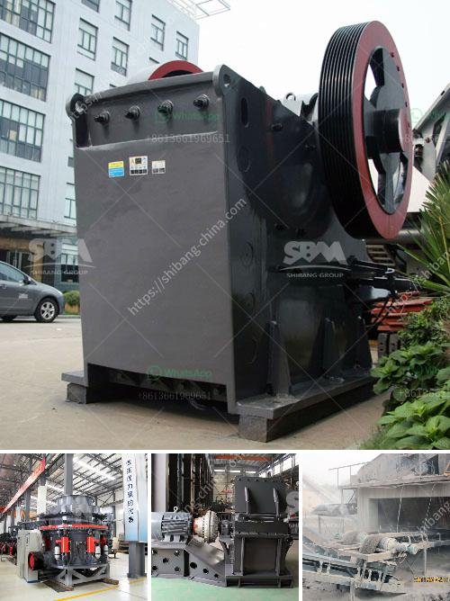

<h3>limestone ball rod mill</h3>
Limestone is one of the most commonly used materials in the construction industry. It is widely available and can be used as a building material or as the starting material for various industries. Limestone is primarily composed of calcium carbonate, making it an excellent source of calcium for both plants and animals.

To utilize limestone effectively, it needs to be processed into a specific size. This is where grinding equipment such as limestone ball/rod mills come into play. These mills are specifically designed for grinding limestone, ensuring its proper size and chemical composition. The mills can be used in various applications, including cement production, metallurgy, chemical industry, and power plants.

The limestone ball/rod mill is a horizontal cylindrical rotating device that uses external gear transmission. It consists of a grinding chamber, grinding media (steel balls or rods), and an inlet and outlet. The inlet is located at one end of the mill while the outlet is at the opposite end. The mill is driven by a motor coupled with a reducer.

The grinding process in the ball/rod mill starts with the introduction of the limestone and grinding media into the grinding chamber. The rotation of the cylinder generates centrifugal force that brings the steel balls or rods to a certain height. Due to gravity, the grinding media then falls down, impacting and grinding the limestone particles.

As the limestone is being ground, its size is continuously reduced. The shape and size of the grinding media affect the efficiency and effectiveness of the grinding process. Generally, steel balls are used for coarse grinding, while rods are used for fine grinding. The media size and type can be adjusted to achieve the desired fineness of the ground limestone.

One of the advantages of using a limestone ball/rod mill is its versatility. The mill can be used for both dry and wet grinding processes, allowing it to handle various types of limestone. Moreover, the mills can be operated in a batch or continuous mode, giving users the flexibility to adjust the grinding process to suit their specific needs.

Another advantage of the limestone ball/rod mill is its relatively low operating cost. The mills are simple in design, requiring minimal maintenance and energy consumption. This makes them a cost-effective solution for processing limestone on a large scale. Additionally, the mills are robust and durable, ensuring long-term operation without significant wear or breakdowns.

In conclusion, a limestone ball/rod mill is a versatile grinding equipment used in various industries for processing limestone. It offers the advantages of low operating cost, minimal maintenance, and the ability to handle both dry and wet grinding processes. The mill's simplicity and durability make it a reliable choice for large-scale limestone processing. Whether used in cement production, metallurgy, chemical industry, or power plants, the limestone ball/rod mill proves to be an essential tool in finely grinding limestone.
<h3>Contact us</h3><ul><li><strong>Whatsapp:&nbsp;<a href="https://wa.me/8613661969651">+8613661969651</a></strong></li><li><a href="https://swt.shibang-china.com/?git&amp;zhl&amp;limestone ball rod mill"><strong>Online Service(chat now)</strong></a></li></ul><h3>Related</h3><ul><li><a href='small concrete crusher.md'>small concrete crusher</a></li><li><a href='kaolin crusher price.md'>kaolin crusher price</a></li><li><a href='dolomite crushing machine mill.md'>dolomite crushing machine mill</a></li><li><a href='what is cost for 50 tpd cement plant.md'>what is cost for 50 tpd cement plant</a></li><li><a href='how to separate gold from sand with machine.md'>how to separate gold from sand with machine</a></li></ul>