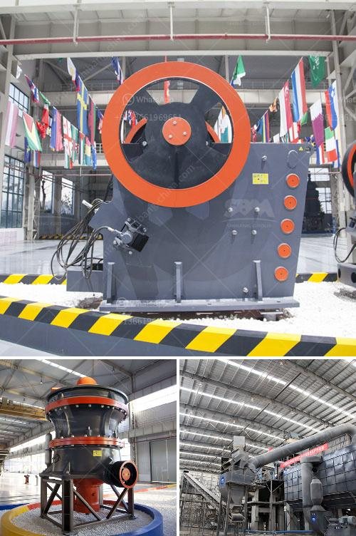

<h3>limestone beneficiation</h3>
Limestone beneficiation is the process of improving the quality of limestone by removing impurities. It involves processes such as crushing, screening, and washing. Limestone deposits are abundant in nature, and extracting and processing them is a vital aspect of the construction industry. Limestone is used as a building material, industrial raw material, and in the production of cement, among other applications.

The beneficiation of limestone aims to remove unwanted materials such as silica, clay, and iron oxides, which reduce the overall quality of the limestone. These impurities can negatively affect the properties of the final product, making it less durable and of lower quality.

The beneficiation process involves various techniques to remove the impurities selectively. Crushing and screening are the primary steps, where large blocks of limestone are crushed into smaller sizes and screened to separate different grades of limestone.

Washing is another important process in limestone beneficiation. It helps remove clay and other impurities that adhere to the limestone particles. This is usually achieved through a combination of mechanical agitation and chemical treatments.

Using advanced beneficiation techniques, it is possible to achieve high-quality limestone suitable for a wide range of applications. The primary goal is to maximize the yield of usable limestone while minimizing the loss of material during the beneficiation process. This helps improve the overall efficiency and sustainability of limestone extraction and usage.

Limestone beneficiation plays a crucial role in ensuring that construction projects can utilize high-quality limestone that meets the required specifications. By removing impurities, the resulting limestone can be used in various applications with confidence, including in the construction of buildings, roads, and infrastructure.

In conclusion, limestone beneficiation is a necessary process to improve the quality of limestone and ensure its optimal utilization in the construction industry. By removing impurities, it enhances the properties of limestone, making it a valuable and versatile material for various applications.
<h3>Contact us</h3><ul><li><strong>Whatsapp:&nbsp;<a href="https://wa.me/8613661969651">+8613661969651</a></strong></li><li><a href="https://swt.shibang-china.com/?git&amp;zhl&amp;limestone beneficiation"><strong>Online Service(chat now)</strong></a></li></ul><h3>Related</h3><ul><li><a href='sand making plant supplier process crusher.md'>sand making plant supplier process crusher</a></li><li><a href='crusher machine made in england.md'>crusher machine made in england</a></li><li><a href='ominer supplies namibia jaw crushers.md'>ominer supplies namibia jaw crushers</a></li><li><a href='suplier sand making machine from philippines.md'>suplier sand making machine from philippines</a></li><li><a href='process of talcum powder mill.md'>process of talcum powder mill</a></li></ul>