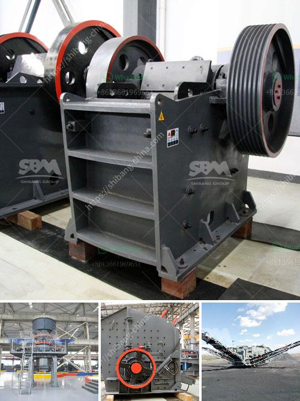

<h3>limestone crusher cost</h3>
When it comes to evaluating the cost of a limestone crusher, there are several important factors to consider. This article will explore them in detail.

Budget: It's always important to budget for any project, including crusher installation. Whether you're starting a new limestone quarry or adding a new crusher to your existing operation, the upfront costs can be significant. This is why it's crucial to consider the capital cost of the crusher and the operational expenses associated with it.

Crusher Type: There are different types of crushers available in the market, including compression crushers, impact crushers, and cone crushers. Each type has its own advantages and disadvantages, so it's essential to choose the right crusher for your specific application. Factors such as production requirements, feed size, and final product size should be taken into account when selecting the crusher type.

Size of Limestone Input: The size of the limestone input plays a significant role in determining the crusher cost. If the limestone is large, it may require a primary crusher before being fed into the secondary or tertiary crusher. On the other hand, if the limestone is small in size, it can directly be fed into the crusher without any pre-processing, reducing the overall cost.

Production Capacity: The production capacity of the crusher, measured in tons per hour, is another important factor to consider. Higher production capacity means higher equipment cost but also higher efficiency and output. It's crucial to strike the right balance between cost and production capacity, ensuring optimal productivity for your operation.

Maintenance and Operation Costs: Apart from the initial capital cost, regular maintenance and operational expenses should also be taken into account. Some crushers require more frequent maintenance and have higher operational costs, while others are relatively low-maintenance units. It's necessary to factor in the maintenance and operation costs over the crusher's lifespan to get an accurate estimation of the total cost of ownership.

Energy Efficiency: Energy consumption is a significant cost in any industrial operation. Efficient crushers can help minimize energy usage, resulting in cost savings. Newer crusher models often come with energy-efficient technologies and features that can reduce energy consumption significantly. Considering the long-term energy costs can play a crucial role in selecting the right crusher for your limestone operation.

Conclusion: When evaluating the cost of a limestone crusher, various factors must be considered, including the budget, crusher type, limestone input size, production capacity, maintenance and operation costs, and energy efficiency. By carefully assessing these factors, you can make an informed decision and choose the crusher that best suits your requirements while keeping the cost in control.
<h3>Contact us</h3><ul><li><strong>Whatsapp:&nbsp;<a href="https://wa.me/8613661969651">+8613661969651</a></strong></li><li><a href="https://swt.shibang-china.com/?git&amp;zhl&amp;limestone crusher cost"><strong>Online Service(chat now)</strong></a></li></ul><h3>Related</h3><ul><li><a href='copper ore mining for sale in philippines.md'>copper ore mining for sale in philippines</a></li><li><a href='largest crusher manufacturing company.md'>largest crusher manufacturing company</a></li><li><a href='mini cement plant project cost india.md'>mini cement plant project cost india</a></li><li><a href='india stone crusher machine price.md'>india stone crusher machine price</a></li><li><a href='rock crushers uk.md'>rock crushers uk</a></li></ul>