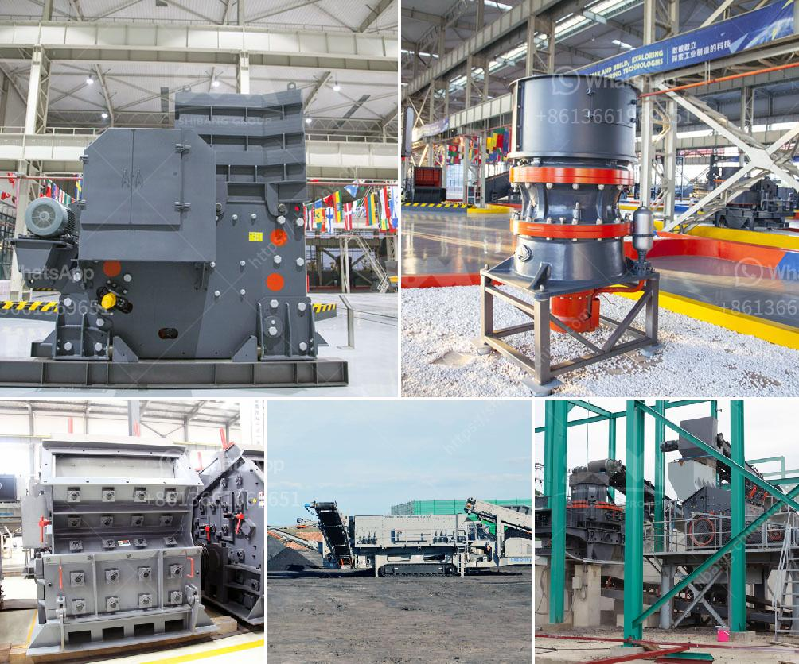

<h3>limestone crusher plant price in india</h3>
Limestone crushing plant in India is composed of the vibrating feeder, jaw crusher, impact crusher, vibrating screen, and belt conveyor. It is widely used in mining, quarry, and construction industries. The production capacity of limestone crushing plant can reach 1,000 tons per hour.

The jaw crusher, cone crusher, impact crusher, VSI sand making machine, vibrating screen, and other related equipment are suitable for limestone crushing plant. The limestone crusher machine is a equipment which can crush materials about 600-1800mm into materials about 25mm or smaller. It can crush various kinds of medium hardness materials such as: limestone, slag, coke, coal and other materials. This kind of crusher has large crushing ratio, long service life, reasonable structure, convenient maintenance, etc. It is suitable for crushing medium and above hardness materials.

The price of limestone crusher plant in India is very high and it is very rare in many small and medium-sized cities. There are more than 200 limestone mining and crushing units in India, which are spread all over the country and located in various parts of the country. India's limestone reserves are also very large, ranking fourth in the world, with an estimated output of 380 million tons per year. However, the limestone resources are unevenly distributed, and the processing technology and production equipment are relatively backward. This leads to a big gap between the supply and demand of limestone in India and a high price of limestone crusher plant.

1. The capacity of the plant: As a large-scale limestone crushing plant, the capacity of the jaw crusher, cone crusher, impact crusher, VSI sand making machine, vibrating screen, and belt conveyor are all according to the requirements of the clients. Therefore, the investment cost calculations for a 150-200 tph limestone crushing plant in India should consider factors like the input size, limestone hardness, raw materials, and output size.

2. Equipment suppliers: Generally, the prices of limestone crusher machines are often considered by factors such as equipment suppliers, production materials, market demand, choice of manufacturers, etc. Therefore, the limestone crusher plant price in India can be different.

3. Transport costs: The transportation cost of limestone crushing production line in India is mainly affected by the distance and transport costs between the processing site and the port city. This factor has a significant impact on the price.

4. External factors: Market supply and demand changes are usually related to changes in national industrial policy, taxes, trade policies, etc. There are times when the price of limestone crusher plants in India fluctuates greatly due to national policies and market supply and demand.

In conclusion, limestone crusher plant price in India is different due to the different factors mentioned above. Generally speaking, purchasing a 200-300 tons of limestone crushing plant in India is about 300,000-500,000 dollars. Of course, we can design a specific crushing production line according to the actual needs of customers, supporting more professional and higher quality machines.
<h3>Contact us</h3><ul><li><strong>Whatsapp:&nbsp;<a href="https://wa.me/8613661969651">+8613661969651</a></strong></li><li><a href="https://swt.shibang-china.com/?git&amp;zhl&amp;limestone crusher plant price in india"><strong>Online Service(chat now)</strong></a></li></ul><h3>Related</h3><ul><li><a href='concrete stone making machine south africa.md'>concrete stone making machine south africa</a></li><li><a href='small scale hard rock gold ore processing.md'>small scale hard rock gold ore processing</a></li><li><a href='stone crusher machine factory in china.md'>stone crusher machine factory in china</a></li><li><a href='ore wash plant for sale.md'>ore wash plant for sale</a></li><li><a href='crusher plant cost estimation.md'>crusher plant cost estimation</a></li></ul>