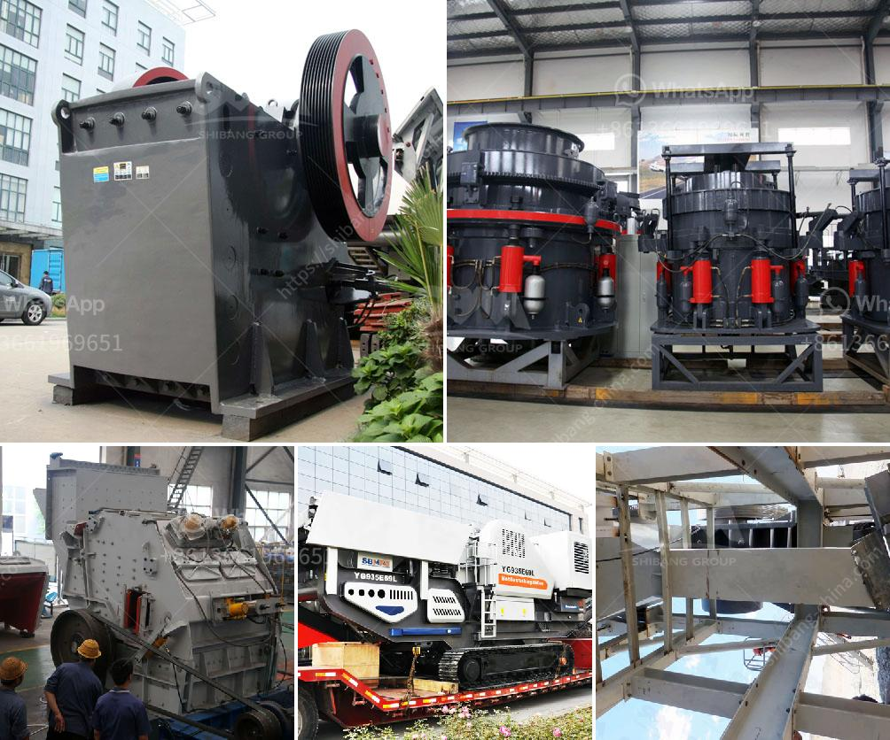

<h3>limestone crusher rotor mechanical</h3>
Limestone is a sedimentary rock that is mainly composed of calcium carbonate (CaCO3). Its mineral composition can vary, but it usually contains impurities such as clay, silt, and sand. This versatile rock is widely used in construction, agriculture, and other industries due to its strength and durability.

To process limestone into desired sizes, a limestone crusher is needed. This machine works by breaking the large size limestone chunks into smaller pieces. The crusher rotor plays a vital role in the overall performance of the crusher. It affects the crushing efficiency and capacity, as well as the final product quality.

The rotor is the main working part of a limestone crusher. It consists of a spindle, a disc, and a hammer. The spindle, also known as the main shaft, is an important component of the rotor. It holds the disc and the hammer together and transmits the power generated by the motor to the disc.

The disc, also known as the rotor plate, is a flat circular plate with evenly distributed hammer slots. The hammers are mounted on these slots and are free to swing or rotate. When the rotor spins at a high speed, the hammers strike the limestone and break it down into smaller particles.

The design of the rotor is crucial for the crusher's performance. It needs to be sturdy and durable, able to withstand the high-speed impact forces. The rotor should also have a balanced configuration to reduce vibration and ensure smooth operation. Additionally, the shape and weight of the hammers should be carefully considered to optimize the crushing process.

There are several advantages of a well-designed limestone crusher rotor. Firstly, it improves the crushing efficiency. The high-speed impact forces generated by the rotor break the limestone into smaller particles with minimal energy input. This reduces the overall energy consumption and improves the crusher's productivity.

Secondly, a good rotor design enhances the crushing capacity. The rotor's shape and weight distribution allow for a greater material intake, enabling the crusher to process larger quantities of limestone in a shorter amount of time. This is particularly important in applications where a high production rate is required.

Moreover, a well-designed rotor contributes to the final product quality. The hammers' precise weight and configuration ensure uniform crushing and minimize the production of fine particles or dust. This enhances the overall grading and quality of the crushed limestone, making it suitable for various applications.

In conclusion, the rotor is a critical component of a limestone crusher. Its design and mechanical properties greatly impact the crusher's performance, efficiency, and final product quality. A well-designed rotor improves the crushing capacity, reduces energy consumption, and ensures a uniform particle size distribution. Therefore, manufacturers and operators of limestone crushers should pay close attention to the rotor's mechanical characteristics to maximize the crusher's overall effectiveness and achieve desired outcomes.
<h3>Contact us</h3><ul><li><strong>Whatsapp:&nbsp;<a href="https://wa.me/8613661969651">+8613661969651</a></strong></li><li><a href="https://swt.shibang-china.com/?git&amp;zhl&amp;limestone crusher rotor mechanical"><strong>Online Service(chat now)</strong></a></li></ul><h3>Related</h3><ul><li><a href='list of machinery used in the quarry.md'>list of machinery used in the quarry</a></li><li><a href='concrete crusher hire nigeria.md'>concrete crusher hire nigeria</a></li><li><a href='stone crushing in pakistan.md'>stone crushing in pakistan</a></li><li><a href='ball mill shell materials.md'>ball mill shell materials</a></li><li><a href='bentonite powder making.md'>bentonite powder making</a></li></ul>