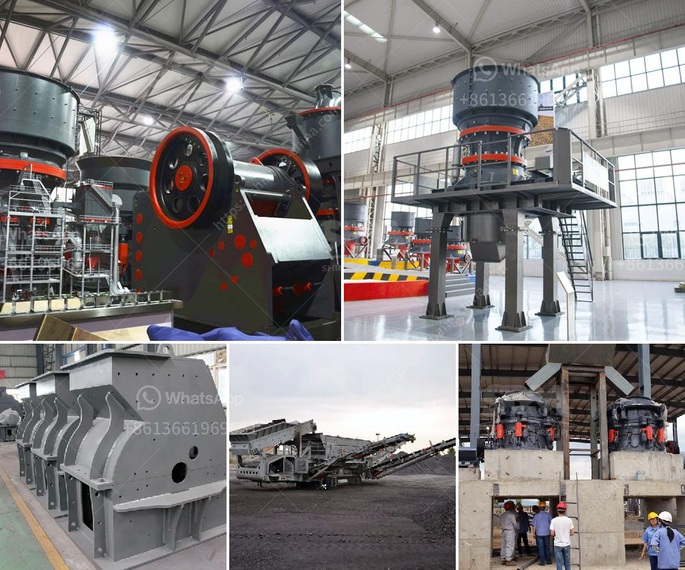

<h3>limestone crushing and screening</h3>
Limestone is a sedimentary rock composed mostly of calcium carbonate (CaCO3), usually in the form of calcite or aragonite. It is a widespread rock type which can be found in many parts of the world, including the United States, China, Egypt, and Europe. Limestone is a versatile material with many uses and applications.

Crushing and screening are two common processes in limestone processing operations. Crushing is the first stage in the size reduction process, followed by further grinding and screening to produce various sizes of aggregate or gravel. Limestone crushing is an important step in the cement production line, as it directly affects the quality and quantity of material used in cement manufacturing.

Crushing and screening are both typically accomplished by mechanical means. Crushing can be done in three or four stages, primary (jaw crusher), secondary (impact crusher), tertiary (cone crusher), and, in some quarries, a quaternary (vertical impact crusher). Limestone can be directly processed into stone and fired into quicklime.

During the crushing process, large pieces of limestone are fed into the jaw crusher for primary crushing by vibrating feeder. The crushed limestone is then transferred to the impact crusher for secondary crushing. The output obtained from the secondary crusher is further sieved through vibrating screens to obtain different stone sizes.

After crushing, the limestone is classified based on its size. Screening is the process of separating particles into multiple size fractions, usually by vibrating screens. The screens are commonly used to maintain uniformity in size reduction operations and remove unwanted oversized or undersized materials.

There are a few factors that need to be considered while screening limestone. The first is the particle size distribution of the material. Depending on the desired end product, different screen sizes and configurations are used. For example, if fine aggregates are required, a fine-mesh screen with smaller openings is used, while for larger aggregates, a coarse-mesh screen is preferred.

Another factor to consider is the moisture content of the limestone. Wet screening is commonly used when the moisture content is high because it allows for easier separation of fine and coarse particles. On the other hand, dry screening is more suitable for low moisture content limestone.

The screening process also helps in removing impurities, such as clay or dirt, from the crushed limestone. This enhances the quality of the end product and ensures that it meets the required specifications. It also prevents any contamination that could affect the performance of the limestone in various applications.

In conclusion, limestone crushing and screening are essential processes in limestone production. They significantly impact the quality and quantity of material used in cement manufacturing and construction projects. Mechanical means are typically used for crushing and screening, and the end products are classified based on size and moisture content. These processes enhance the versatility and usability of limestone, making it a valuable resource in various industries.
<h3>Contact us</h3><ul><li><strong>Whatsapp:&nbsp;<a href="https://wa.me/8613661969651">+8613661969651</a></strong></li><li><a href="https://swt.shibang-china.com/?git&amp;zhl&amp;limestone crushing and screening"><strong>Online Service(chat now)</strong></a></li></ul><h3>Related</h3><ul><li><a href='primary crushers.md'>primary crushers</a></li><li><a href='china silica sand vibrating screen.md'>china silica sand vibrating screen</a></li><li><a href='gold ore crusher machine.md'>gold ore crusher machine</a></li><li><a href='ethiopia stone crushing industry.md'>ethiopia stone crushing industry</a></li><li><a href='project plan about stone crashing machine.md'>project plan about stone crashing machine</a></li></ul>