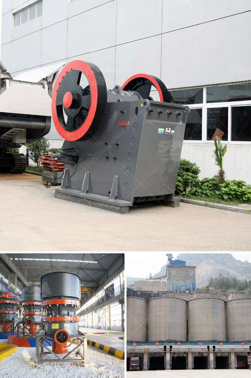

<h3>limestone crushing plant sale in pakistan</h3>
Limestone is a sedimentary rock composed mainly of calcium carbonate (CaCO3), usually in the form of calcite or aragonite. It is a widely used building material and industrial raw material. Limestone is widely distributed, with abundant reserves and high value. It is an indispensable raw material for infrastructure construction in Pakistan. So why is the limestone crushing plant sale in Pakistan necessary?

Pakistan has abundant mineral resources, including limestone, coal, copper, gold, granite, marble, and gypsum. The country has the second largest salt mines in the world, and mining is a vital industry for the economic development of Pakistan.

Limestone deposits in Pakistan are found in the valleys of the Suleman and Kirthar mountain ranges and in the upper Indus River Valley. The country has a large limestone quarrying and crushing industry, which plays an important role in promoting economic development.

Limestone is widely used in industries such as metallurgy, chemical industry, cement, agriculture, petroleum, building materials, glass, and various other industries. To meet the requirements of different fields, the limestone crushing plant sale in Pakistan can be customized in different capacities, materials, and specifications. The configuration scheme of limestone crushing plant includes vibrating feeder, jaw crusher, impact crusher, vibrating screen, belt conveyor, and central control system.

Limestone is a valuable resource that is widely used. In the modern construction industry, limestone is the main raw material for cement, lime, and calcium carbide. It is an indispensable flux limestone in the metallurgical industry. After processing, high-quality limestone can be widely used in the production of papermaking, rubber, paint, coating, medicine, cosmetics, feed, sealing, bonding, polishing, and other products.

The limestone crushing plant sale in Pakistan provides investors with a perfect solution, incorporating optimized performance, low maintenance, and low capital investment. As a successful limestone crushing plant manufacturer in Pakistan, we have successfully installed jaw crusher, impact crusher, cone crusher, vibrating screen, belt conveyor, centralized control system.

In modern time, the limestone crushing plant is more and more popular in Pakistan. With the continuous advancement of science and technology and economic development, limestone crushing plant has been developed and improved. It can achieve an ideal crushing effect and improve the crushing efficiency in Pakistan. Its crushing cavity adopts a special crushing principle, making more cube-shaped materials without any tension, making it suitable for crushing hard and strong abrasive material.

In conclusion, the limestone crushing plant in Pakistan has a wide application and a promising future. Therefore, it is necessary to learn more about this plant and make better use of it. Contact us for more details and a free customized solution!
<h3>Contact us</h3><ul><li><strong>Whatsapp:&nbsp;<a href="https://wa.me/8613661969651">+8613661969651</a></strong></li><li><a href="https://swt.shibang-china.com/?git&amp;zhl&amp;limestone crushing plant sale in pakistan"><strong>Online Service(chat now)</strong></a></li></ul><h3>Related</h3><ul><li><a href='gypsum powder production equipment price.md'>gypsum powder production equipment price</a></li><li><a href='mobile chrome wash plant for sale.md'>mobile chrome wash plant for sale</a></li><li><a href='gypsum deposit in indonesia.md'>gypsum deposit in indonesia</a></li><li><a href='rock stone zambia mining crushing plants.md'>rock stone zambia mining crushing plants</a></li><li><a href='grinding mill to produce particle size.md'>grinding mill to produce particle size</a></li></ul>