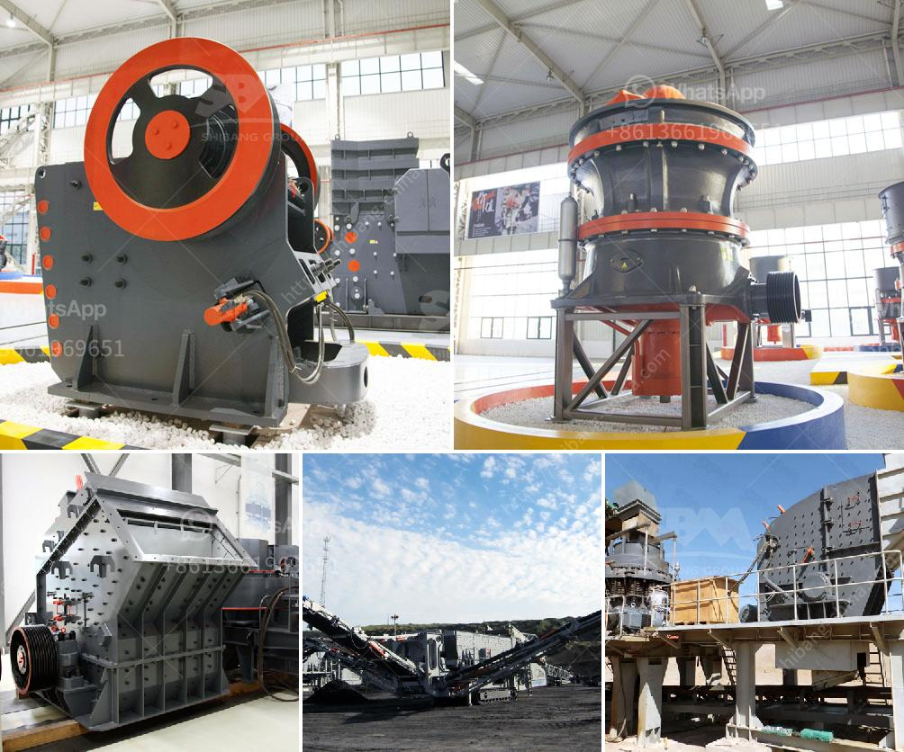

<h3>limestone crushing project 300 ton per day</h3>
Limestone is a sedimentary rock that is mainly composed of calcium carbonate (CaCO3). Limestone is widely used in various industries such as construction, road construction, and in the manufacture of chemicals and cement. To extract these valuable minerals, some mining machines are necessary such as jaw crusher, impact crusher, cone crusher, vertical impact crusher, ball mill, vibrating feeder, vibrating screen, classifiers, belt conveyors and grizzlies.

Before crushing limestone, we need firstly crush raw material limestone into smaller size for jaw crusher and impact crusher. The max input size of limestone is about 400 mm and the required output size range are 0-20 mm and 20-40 mm. To prepare the material for the crusher, limestone is often processed into a slurry.

For this specific project, a daily crushing capacity of 300 tons per day is required. The company has been granted permission to extract up to 10 million tons of limestone per year. This quarry is located about 30 kilometers from the nearby town and is accessible via a road network.

The limestone raw materials are fed into the primary jaw crusher 600x900 by vibrating feeder, and then they are transported to the secondary jaw crusher PEX250x1200 by belt conveyor. The crushed limestone is evenly sent to the vibrating screen by the belt conveyor for screening, and the screened limestone is sent to the finished product area by the belt conveyor for packaging and storage.

1. Primary jaw crusher 600x900: The limestone raw materials are evenly fed into the jaw crusher through the vibrating feeder. The primary jaw crusher performs the first crushing of the limestone, discharging it to a vibrating screen for inspection.

2. Secondary jaw crusher PEX250x1200: After the primary crushing process, the crushed limestone enters the secondary jaw crusher PEX250x1200 for further crushing. The crushed limestone is then screened by a vibrating screen to ensure the particle size is within the required range.

After the secondary crushing process, the limestone products are used as raw materials in various construction applications such as road construction, building construction, and the manufacture of cement.

The project's main challenge is to ensure the efficient crushing of limestone while maintaining the highest safety standards. To address this, the project team has implemented a set of safety regulations, including the use of personal protective equipment (PPE), regular equipment maintenance, and the establishment of safety protocols for all workers.

In conclusion, the limestone crushing project undertaken by our company is of great significance. It not only meets the requirements of the construction industry but also contributes to the sustainable development of the local economy. With a daily crushing capacity of 300 tons per day, this project plays a crucial role in meeting the increasing demand for limestone in various industries. Through effective planning, efficient operations, and the implementation of strict safety measures, our team is committed to the successful completion of this project.
<h3>Contact us</h3><ul><li><strong>Whatsapp:&nbsp;<a href="https://wa.me/8613661969651">+8613661969651</a></strong></li><li><a href="https://swt.shibang-china.com/?git&amp;zhl&amp;limestone crushing project 300 ton per day"><strong>Online Service(chat now)</strong></a></li></ul><h3>Related</h3><ul><li><a href='granite crushing production line.md'>granite crushing production line</a></li><li><a href='price of central vertical roller mill.md'>price of central vertical roller mill</a></li><li><a href='komatsu crawler jaw crusher.md'>komatsu crawler jaw crusher</a></li><li><a href='copper crushing machines manufacturers in china.md'>copper crushing machines manufacturers in china</a></li><li><a href='rodillos para trituradoras en bogota.md'>rodillos para trituradoras en bogota</a></li></ul>