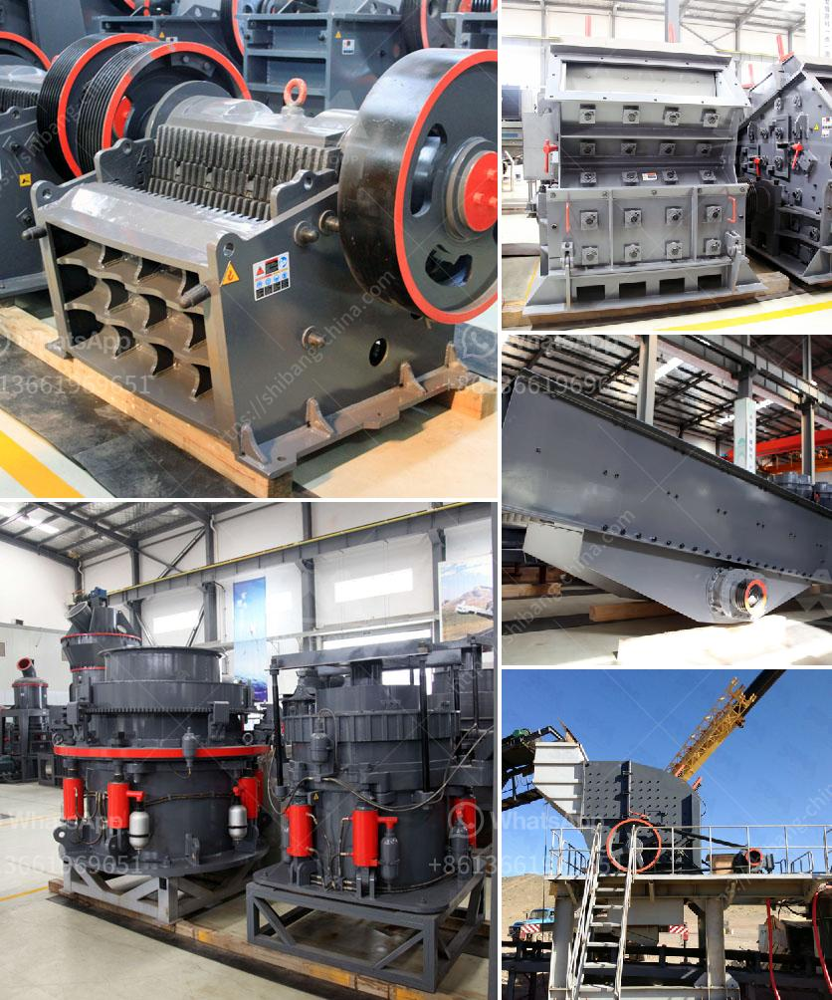

<h3>limestone grinding mill china</h3>
China limestone grinding mill produces a wide range of finished powders for a variety of applications, including agriculture, construction, and industrial processes. With development of modern industry, limestone production in China has been growing rapidly. The excellent processing capabilities and numerous uses of limestone have prompted more and more manufacturers to choose a limestone grinding mill in China.

Limestone is a naturally occurring mineral that is composed mostly of calcite. The main component of calcite is calcium carbonate, which is used in various fields such as construction, agriculture, and industry. With the increasing demand for limestone products, grinding mills have become an essential equipment in the industry.

China has rich limestone resources, with limestone reserves ranking first in the world. The abundance of limestone resources has laid a solid foundation for the development of grinding mills in China. With advances in grinding technology, the limestone grinding mill can easily process high-quality limestone powder, which is widely used in the following industries:

1. Construction: Limestone powder can be used as a filler in concrete to improve its workability and strength. It is also commonly used as a coating material to give buildings a smooth and beautiful appearance.

2. Agriculture: Limestone powder is widely used as a soil conditioner to improve the fertility of agricultural land. It neutralizes soil acidity, improves soil structure, and provides essential nutrients to plants.

3. Industrial Processes: Limestone powder is used in a variety of industrial processes, such as steel production, glass manufacturing, and water treatment. It is a key component in the production of cement, lime, and calcium carbide.

In recent years, with the increasing awareness of environmental protection and energy conservation, China's grinding mill manufacturers have made great efforts to develop new grinding mills with low energy consumption and high efficiency. Advanced grinding mill technology has greatly improved the grinding efficiency and energy utilization rate of limestone.

A limestone grinding mill in China can be used to produce fine limestone powder, ranging from 30 to 2500 mesh. In addition to its wide range of applications, limestone grinding mills are also widely used in the metallurgical industry, mining industry, cement plants, and power plants. Due to the advantages of high grinding efficiency and energy saving, these mills have become the preferred equipment for grinding limestone.

In conclusion, a limestone grinding mill in China is essential equipment for the processing of limestone powder, which can be used in various fields. With the continuous development of China's limestone industry, the market demand for limestone grinding mills is also increasing. Efficiency, energy saving, environmental protection, and stable performance are the key factors to consider when choosing a limestone grinding mill in China. With the further advancement of technology, China's grinding mill manufacturers will continue to improve the performance of grinding mills, providing customers with more efficient and high-quality limestone grinding equipment.
<h3>Contact us</h3><ul><li><strong>Whatsapp:&nbsp;<a href="https://wa.me/8613661969651">+8613661969651</a></strong></li><li><a href="https://swt.shibang-china.com/?git&amp;zhl&amp;limestone grinding mill china"><strong>Online Service(chat now)</strong></a></li></ul><h3>Related</h3><ul><li><a href='impact crusher turkey.md'>impact crusher turkey</a></li><li><a href='stone crusher unit project report.md'>stone crusher unit project report</a></li><li><a href='mobile gold processing plant for sale in south africa.md'>mobile gold processing plant for sale in south africa</a></li><li><a href='brick making business plan pdf.md'>brick making business plan pdf</a></li><li><a href='quarry crushing equipments manufacturers.md'>quarry crushing equipments manufacturers</a></li></ul>