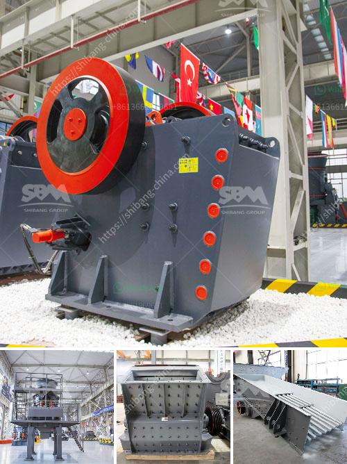

<h3>limestone grinding raymond mill</h3>
Limestone is a sedimentary rock composed largely of the minerals calcite and aragonite, which are different crystal forms of calcium carbonate (CaCO3). Most limestone is composed of skeletal fragments of marine organisms such as coral or foraminifera. Limestone is a common building material which is widely used in industries such as construction, road building and iron and steel production due to its good durability and low cost.

In order to process limestone into fine powder, a suitable limestone grinding mill is needed. Raymond mill is often used as the grinding equipment in limestone grinding process. The mill is widely used in many fields, such as cement, power, metallurgy, chemical industry, non-metallic mineral milling and so on. It has the advantages of high production efficiency, stable operation, large output, and fineness adjustment.

Raymond mill is a vertical structure with a small footprint and a strong system. It can form an independent production system from block limestone to finished powder, which greatly reduces the occupy area. The main transmission device adopts an enclosed gear box and pulleys, which makes the transmission stable and reliable. The main engine is provided with an air inlet, an air outlet and a feeding port. Its structure is simple and the sealing performance is good.

During the operation of Raymond mill, the grinding roller and the grinding ring are the main working components. They are constantly in contact with the material and exert a strong grinding and crushing force. The material is ground and crushed through the pressure exerted by the grinding roller. The blade system installed in the classifier is in a dynamic balance state, which can effectively avoid the vibration generated during the operation of the equipment.

Raymond mill has an important role in the production of limestone powder. Its main function is to grind and pulverize various ores and materials. With the continuous innovation and improvement of technology, the equipment has made great progress in grinding materials. It has been widely used in the fine grinding process of non-metallic minerals, metal ores and solid wastes.

In addition, Raymond mill can also be used for the grinding of limestone, marble, barite, dolomite, talc, kaolin and other materials. Raymond mill is a common grinding equipment in the grinding industry. It has a wide range of applications, and the market demand is large. With the continuous expansion of the scale of industrial production, the increase in demand for mineral powder is also driving the development of the grinding equipment industry.

In summary, Raymond mill is an excellent grinding equipment for limestone powder processing. Its advanced structure, reliable performance, and excellent powder production efficiency make it an ideal limestone grinding mill for customers. If you are in need of limestone grinding equipment, please feel free to contact us, we will provide you with the most suitable grinding solution.
<h3>Contact us</h3><ul><li><strong>Whatsapp:&nbsp;<a href="https://wa.me/8613661969651">+8613661969651</a></strong></li><li><a href="https://swt.shibang-china.com/?git&amp;zhl&amp;limestone grinding raymond mill"><strong>Online Service(chat now)</strong></a></li></ul><h3>Related</h3><ul><li><a href='crusher manufacturers in ahmedabad.md'>crusher manufacturers in ahmedabad</a></li><li><a href='mining conveyors for sale in zimbabwe.md'>mining conveyors for sale in zimbabwe</a></li><li><a href='aggregates crashing plant in nigeria.md'>aggregates crashing plant in nigeria</a></li><li><a href='construction material recycling.md'>construction material recycling</a></li><li><a href='how to start a sand mining business in south africa.md'>how to start a sand mining business in south africa</a></li></ul>