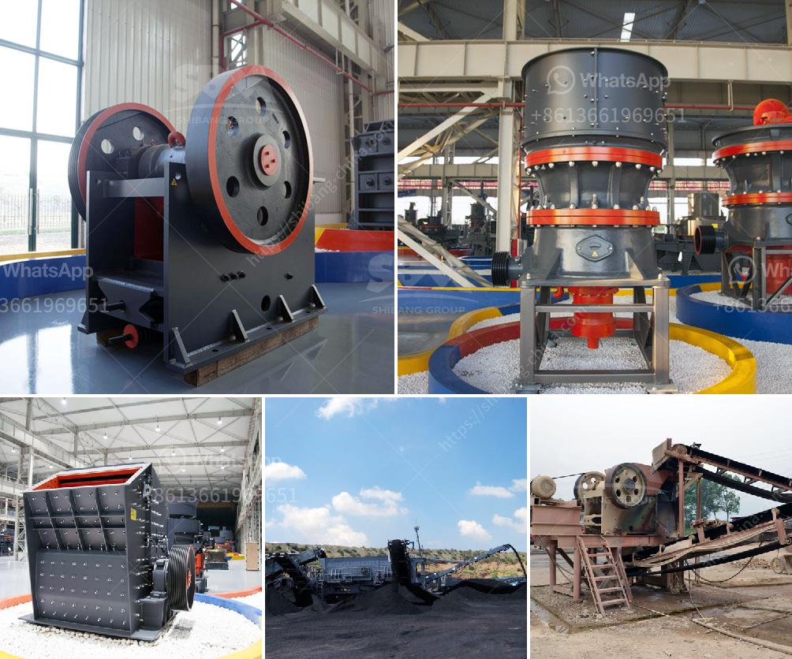

<h3>limestone handling system scheme with grinding mill</h3>
Limestone is an important raw material for industries like construction, agriculture, and manufacturing. It serves as the foundation for the production of cement, lime, and various other products. Handling limestone efficiently is essential for businesses to ensure smooth operations and maximize productivity. One crucial component of the limestone handling process is the grinding mill, which pulverizes limestone into powder form, making it suitable for various industrial applications.

The limestone handling system scheme typically includes processes like receiving, storing, crushing, screening, and grinding limestone. To efficiently handle limestone, operators must ensure proper equipment selection and sizing, as well as consider the overall system design.

When it comes to limestone grinding mills, several factors need consideration. Firstly, the mill should have the capacity to handle the desired throughput, which depends on factors like limestone hardness, moisture content, and particle size distribution. A mill with a higher capacity will ensure continuous operation and prevent production bottlenecks.

The choice of the grinding mill also depends on the required fineness of the limestone powder. Different industries have varying demands, and the mill should be able to produce the desired particle size distribution. It is essential to consider the mill's classifying capabilities, as it helps separate the fine particles from the coarser ones.

Another critical aspect when selecting a limestone grinding mill is the energy efficiency. Efficient mills help save energy and therefore reduce operational costs. Advances in technology have led to the development of more energy-efficient mills, which not only reduces energy consumption but also minimizes carbon emissions and environmental impact.

Moreover, the grinding mill's design plays a crucial role in ensuring smooth operations and maintenance. A well-designed mill should have easy access for maintenance and cleaning to prevent downtime. It should also have built-in safety features to protect workers and equipment.

To further enhance the limestone handling system, some plants have adopted automation and control systems. These systems monitor the limestone handling process, optimize operations, and provide real-time data for analysis and decision-making. Automation can help improve efficiency, reduce human error, and enhance overall system performance.

In conclusion, a comprehensive limestone handling system scheme with an efficient grinding mill is essential for businesses involved in limestone processing. The system should account for factors like limestone hardness, moisture content, and particle size distribution. The grinding mill should have the required capacity and be able to produce the desired fineness of the limestone powder. Energy efficiency, ease of maintenance, and safety features are also critical considerations. By implementing an optimized limestone handling system scheme, businesses can ensure smooth operations, maximize productivity, and meet industry demands.
<h3>Contact us</h3><ul><li><strong>Whatsapp:&nbsp;<a href="https://wa.me/8613661969651">+8613661969651</a></strong></li><li><a href="https://swt.shibang-china.com/?git&amp;zhl&amp;limestone handling system scheme with grinding mill"><strong>Online Service(chat now)</strong></a></li></ul><h3>Related</h3><ul><li><a href='sand and gravel crusher machine for sale philippines.md'>sand and gravel crusher machine for sale philippines</a></li><li><a href='quarry equipment manufacturer asia.md'>quarry equipment manufacturer asia</a></li><li><a href='limestone handling system scheme with grinding mill.md'>limestone handling system scheme with grinding mill</a></li><li><a href='indonesia jaw crusher.md'>indonesia jaw crusher</a></li><li><a href='business plan for quarry.md'>business plan for quarry</a></li></ul>