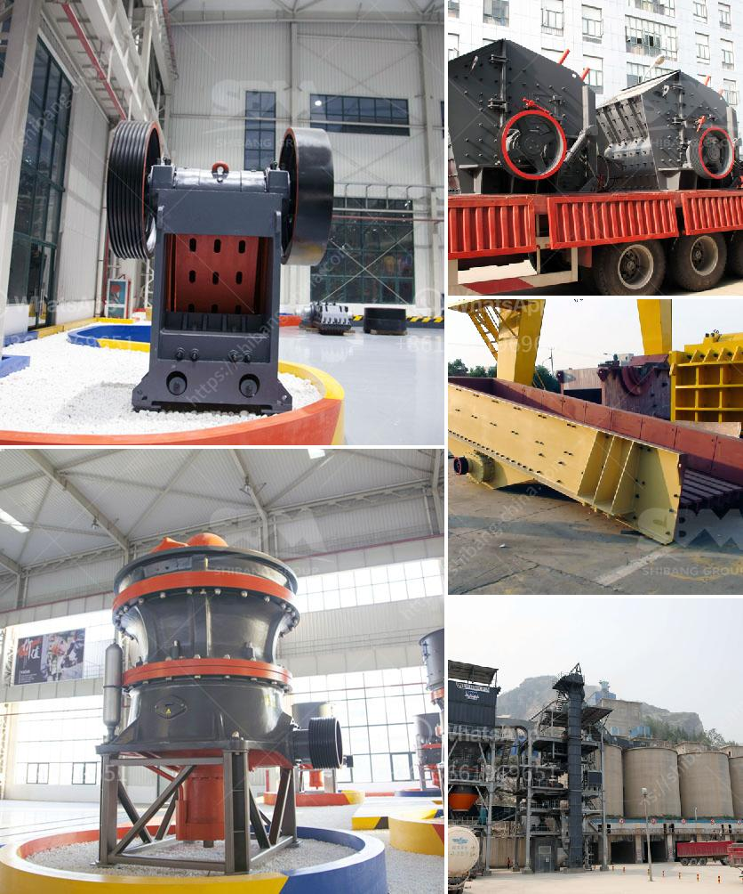

<h3>limestone impact crusher</h3>
Limestone is a common sedimentary rock found all over the world. The primary constituent of limestone is calcite, and the primary mineral in calcite is calcium carbonate. A closely related rock known as dolostone contains both calcium and magnesium carbonates. While limestone is a versatile stone material that can be used to create various products, it can expose some challenges during the mining process. One way to handle these challenges is by using an impact crusher.

Impact crushers are known for their ability to handle large rocks and produce a consistent particle size distribution with minimal dust emissions. These are achieved as a result of the impact forces imparted to the material during the crushing process. Compared to jaw and cone crushers, where reduction ratios are limited, impact crushers are designed to handle much larger feed sizes.

As limestone is relatively softer than other stone materials, an impact crusher is often used to break it down even further. Limestone creates a substantial amount of dust during the mining process, and this dust can negatively affect the surrounding environment. With the help of an impact crusher, limestone particles are reduced in size, resulting in a controlled explosion.

Impact crushers are suitable for processing limestone in various kinds of applications. With a wide range of capacities, they can easily match production demands in different scales of limestone processing plants. Also, they are adaptable to different types of feed materials, such as soft rock, hard rock, and abrasive rock.

In terms of environmental impact, limestone impact crushers are designed to be energy-efficient and reduce dust emission. These machines can be used in conjunction with dust suppression systems to minimize the release of undesirable particles. Air quality considerations are also accounted for, as some impact crushers can be equipped with a water injection system to further reduce dust and noise levels.

Apart from their environmental advantages, limestone impact crushers also have additional benefits. They are highly versatile, capable of producing a variety of end products, including concrete aggregates, road base materials, and asphalt products. This versatility makes impact crushers a valuable part of the limestone processing chain.

Moreover, impact crushers can be customized to accommodate specific industrial requirements. For instance, they can be equipped with wear-resistant blow bars to extend the machine's wear life. Some models may offer adjustable settings, allowing operators to control the desired size and shape of the final product.

In conclusion, limestone impact crushers are a valuable resource for processing limestone. They are capable of producing high-quality aggregates and other materials while minimizing environmental impacts. With proper maintenance and regular inspections, impact crushers can provide years of reliable operation. By selecting the right equipment and configuring it to suit specific needs, limestone processing plants can maximize their productivity and minimize their environmental footprint.
<h3>Contact us</h3><ul><li><strong>Whatsapp:&nbsp;<a href="https://wa.me/8613661969651">+8613661969651</a></strong></li><li><a href="https://swt.shibang-china.com/?git&amp;zhl&amp;limestone impact crusher"><strong>Online Service(chat now)</strong></a></li></ul><h3>Related</h3><ul><li><a href='changchai ballast crusher.md'>changchai ballast crusher</a></li><li><a href='cost of ball mill 40tonns capacity.md'>cost of ball mill 40tonns capacity</a></li><li><a href='price of concrete crushing machine for sale.md'>price of concrete crushing machine for sale</a></li><li><a href='stone crusher for agriculture.md'>stone crusher for agriculture</a></li><li><a href='talc rock crusher.md'>talc rock crusher</a></li></ul>