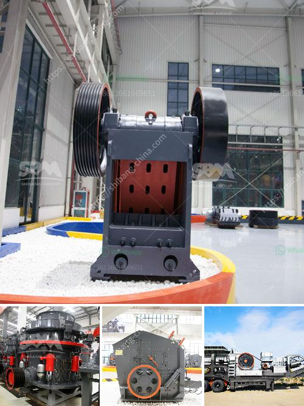

<h3>limestone manufacture process</h3>
Limestone, a naturally occurring sedimentary rock, is a key ingredient in the manufacturing process of many products. From construction materials to toothpaste, limestone is utilized in various industries due to its versatility and abundance. Understanding the limestone manufacturing process is important for anyone involved in these industries or curious about how this rock is transformed into useful products.

The manufacturing process of limestone involves several stages. Firstly, the raw limestone is extracted from quarries and mines through blasting or drilling. This extracted rock is then transported to a crushing plant where it is further refined by grinding into various sizes. The crushed limestone is then mixed with other materials, such as clay or shale, to create a mixture known as raw meal.

Next, the raw meal is heated in a cement kiln to a temperature of about 1400-1500 degrees Celsius. This process, known as calcination, causes the limestone to undergo a chemical transformation, resulting in the formation of calcium oxide or quicklime and carbon dioxide gas. The quicklime is then cooled and stored before undergoing further processing.

The final step in the limestone manufacturing process is known as hydration. In this stage, water is added to the quicklime, creating a chemical reaction that forms calcium hydroxide, also known as slaked lime. This hydrated lime has various applications, including in the construction industry for mortar and plaster, as a pH regulator in industrial processes, and as an ingredient in different products, such as toothpaste and paint.

Limestone manufacturing is a significant industry globally, with numerous companies involved in its production. The process outlined above serves as a general overview of this manufacturing process, but it is important to note that specific techniques and variations may exist depending on the desired end product.

In conclusion, limestone manufacture is a complex process involving extraction, crushing, grinding, calcination, and hydration. This rock plays a crucial role in various industries, offering durability and versatility. Understanding the manufacturing process of limestone allows us to appreciate the widespread use of this valuable material in our everyday lives.
<h3>Contact us</h3><ul><li><strong>Whatsapp:&nbsp;<a href="https://wa.me/8613661969651">+8613661969651</a></strong></li><li><a href="https://swt.shibang-china.com/?git&amp;zhl&amp;limestone manufacture process"><strong>Online Service(chat now)</strong></a></li></ul><h3>Related</h3><ul><li><a href='small concrete crusher.md'>small concrete crusher</a></li><li><a href='china ball mill supplier.md'>china ball mill supplier</a></li><li><a href='crusher for sale in nigeria.md'>crusher for sale in nigeria</a></li><li><a href='quarry crushing equipments manufacturers.md'>quarry crushing equipments manufacturers</a></li><li><a href='philippines crusher manufacturers in pakistan.md'>philippines crusher manufacturers in pakistan</a></li></ul>