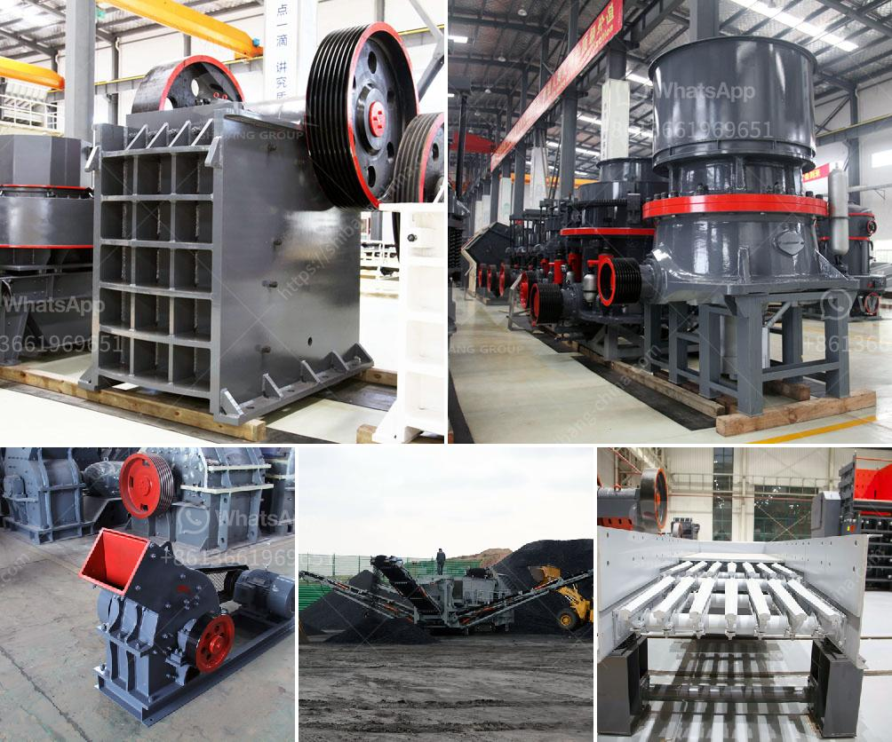

<h3>limestone manufacturing machine</h3>
Limestone is a versatile rock that is widely used in the construction industry. Its abundance and durability make it a popular choice for a range of applications, including building materials, road construction, and agriculture. The manufacturing process of limestone involves extracting the raw material from quarries and converting it into a refined product that can be used in various industries.

One of the key components in the limestone manufacturing process is the limestone manufacturing machine. This machine plays a crucial role in the production of high-quality limestone products and aids in increasing efficiency and productivity in the industry.

The limestone manufacturing machine is designed to crush and grind limestone into a fine powder in order to create a limestone slurry that can be used for various purposes. The machine consists of a crushing chamber, a grinding chamber, limestone feeding mechanism, and a circulating water system. These components work together to efficiently convert limestone blocks into powdered limestone.

The limestone manufacturing machine follows a series of steps to produce a high-quality product. First, the limestone blocks are crushed into smaller pieces by the crushing chamber. This is done to facilitate the grinding process and ensure that the limestone is properly ground into a fine powder. The finely crushed limestone is then fed into the grinding chamber, where it undergoes further grinding to achieve the desired particle size.

The grinding process in the limestone manufacturing machine is facilitated by the use of grinding media, such as steel balls or ceramic balls. These balls help to break down the limestone into smaller particles, ensuring a consistent and fine powder. The grinding media also helps in maintaining the optimal temperature within the grinding chamber, preventing any overheating or temperature fluctuations that could affect the quality of the limestone powder.

In addition to the grinding process, the limestone manufacturing machine also incorporates a circulating water system. This system helps in cooling the limestone and preventing any heat buildup during the grinding process. The cooling effect of the circulating water ensures that the limestone powder remains at a stable temperature, enhancing the quality and consistency of the final product.

The limestone manufacturing machine offers numerous benefits to the construction industry. Firstly, it ensures the production of high-quality limestone powder, which can be used in a variety of applications. From cement production to soil stabilization, limestone powder is a versatile material that enhances the strength and durability of construction materials.

Secondly, the limestone manufacturing machine aids in improving productivity and efficiency in the industry. The machine is capable of processing large quantities of limestone blocks in a relatively short period of time, reducing manual labor and increasing production rates. This results in cost savings for manufacturers and construction companies, as they can produce more limestone products in less time.

Furthermore, the limestone manufacturing machine is designed with safety features to ensure the well-being of workers. It incorporates mechanisms to prevent accidents and minimize dust generation, which can contribute to respiratory health issues. The machine also requires minimal maintenance, reducing downtime and optimizing workflow in the production process.

In conclusion, the limestone manufacturing machine is a vital component in the limestone production process. Its role in crushing, grinding, and refining limestone blocks into powdered limestone enhances the quality of construction materials and contributes to the efficiency and productivity of the construction industry. With its numerous benefits, the limestone manufacturing machine is expected to continue advancing the construction industry and shaping the infrastructure of the future.
<h3>Contact us</h3><ul><li><strong>Whatsapp:&nbsp;<a href="https://wa.me/8613661969651">+8613661969651</a></strong></li><li><a href="https://swt.shibang-china.com/?git&amp;zhl&amp;limestone manufacturing machine"><strong>Online Service(chat now)</strong></a></li></ul><h3>Related</h3><ul><li><a href='mining equipment price in ghana.md'>mining equipment price in ghana</a></li><li><a href='used raymond grinding mill sale offer in pakistan.md'>used raymond grinding mill sale offer in pakistan</a></li><li><a href='jaw crusher supplier.md'>jaw crusher supplier</a></li><li><a href='black powder ball mill grinder.md'>black powder ball mill grinder</a></li><li><a href='calcium oxide powder grinders.md'>calcium oxide powder grinders</a></li></ul>