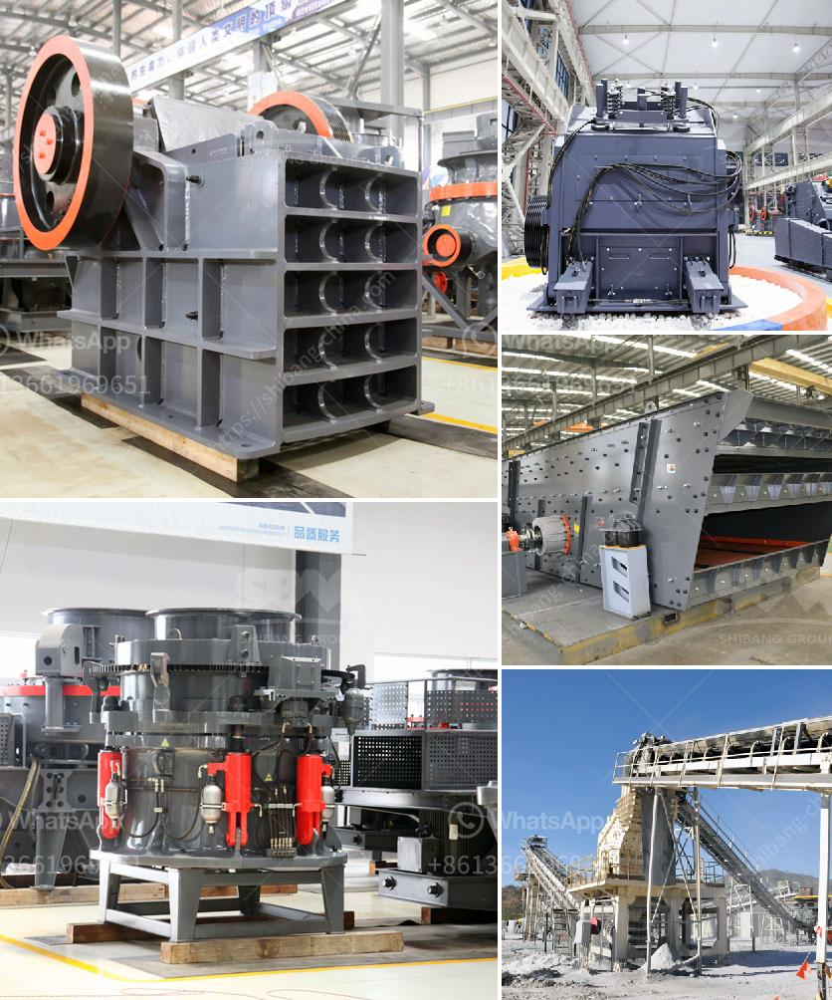

<h3>limestone ore processing plant</h3>
Limestone is a sedimentary rock composed mostly of calcite and aragonite, which are different crystal forms of calcium carbonate. It is one of the main raw materials used in the production of cement, and is also used in the construction, agriculture, and industrial sectors.

To produce high-quality limestone, the ore is first crushed and screened to size. The limestone is then subjected to a series of chemical and physical processes in a limestone ore processing plant. These processes involve various types of crushers, mills, classifiers, and other equipment to achieve the desired product quality and outcomes.

The ore is typically further reduced in size using primary and secondary crushers before being stored in stockpiles. From there, the limestone is transferred to the grinding mills, where it is ground into a fine powder. This powder is then mixed with other materials, such as clay or shale, and heated in a kiln to produce cement clinker.

During the processing of limestone ore, various impurities may be present and need to be removed. The ore may go through a process of beneficiation, in which impurities are separated from the limestone using various techniques such as floatation, magnetic separation, or gravity separation. This helps in improving the quality of the final product.

Limestone ore processing plants may also include additional equipment such as preheaters, cyclones, and baghouses. These help in reducing emissions and controlling the temperature and humidity of the environment. Additionally, water may be used during the processing to control dust and control the temperature of the process.

Overall, limestone ore processing plants play a crucial role in the production of high-quality limestone. These plants utilize a range of techniques and equipment to process the raw material and achieve the desired product quality. The final product is then used in various industries, such as construction, agriculture, and manufacturing, contributing to economic growth and development.
<h3>Contact us</h3><ul><li><strong>Whatsapp:&nbsp;<a href="https://wa.me/8613661969651">+8613661969651</a></strong></li><li><a href="https://swt.shibang-china.com/?git&amp;zhl&amp;limestone ore processing plant"><strong>Online Service(chat now)</strong></a></li></ul><h3>Related</h3><ul><li><a href='nigeria grinding mills price.md'>nigeria grinding mills price</a></li><li><a href='new technology stone crusher.md'>new technology stone crusher</a></li><li><a href='belt conveyor continental di indonesia.md'>belt conveyor continental di indonesia</a></li><li><a href='crusher plant for sale in saudi.md'>crusher plant for sale in saudi</a></li><li><a href='feldspar crusher manufacturer.md'>feldspar crusher manufacturer</a></li></ul>