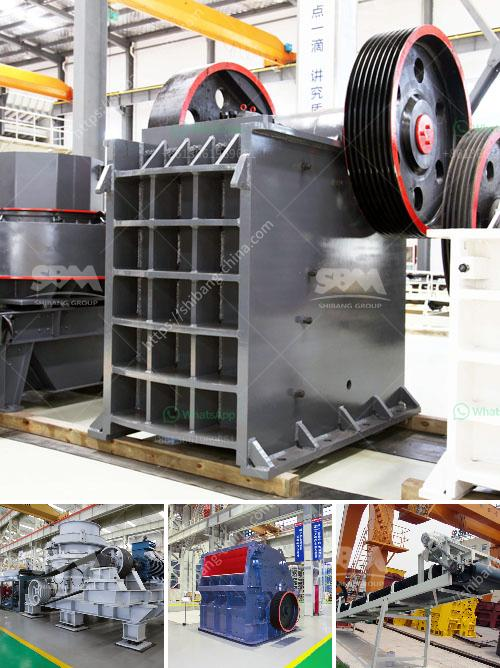

<h3>limestone plant and machinery</h3>
Limestone Plant and Machinery: Enhancing the Efficiency and Productivity of the Construction Industry

The construction industry plays a pivotal role in shaping the infrastructure of any nation. From residential buildings to large-scale infrastructure projects such as bridges and highways, the industry creates a foundation for progress and development. And at the heart of this industry lies the use of limestone, a versatile and widely used building material. In order to extract and process limestone efficiently, plant and machinery are crucial components of the construction process.

Limestone, a sedimentary rock composed primarily of calcium carbonate, is abundant and widely distributed. It is known for its strength and durability, making it an ideal material for construction purposes. Its versatility is further enhanced by the various types of finishes it can be given, such as polished, honed, or bush-hammered, making it suitable for both interior and exterior applications.

To harness the potential of limestone, sophisticated plant and machinery are employed at mining sites and processing facilities. At mining sites, advanced drilling equipment is used to extract limestone from the earth. This process involves drilling deep into the ground and blasting the limestone to loosen it. Once the limestone is extracted, it is transported to processing facilities, where it undergoes various stages of refinement.

In processing facilities, highly specialized machinery is utilized to further refine the limestone, ensuring its suitability for construction purposes. The machinery employed includes crushers, mills, and kilns, all geared towards converting the raw limestone into a usable and consistent product. Crushers break down the limestone into smaller fragments, and mills further grind these fragments into a fine powder. Kilns, on the other hand, use heat to chemically transform the limestone into another compound called quicklime.

The importance of efficient plant and machinery in the limestone industry cannot be overstated. With the right equipment, the process of extracting and processing limestone becomes quicker, more precise, and cost-effective. This ultimately translates into increased efficiency and productivity in the construction industry.

One of the key benefits of advanced limestone plant and machinery is the ability to minimize waste. With precise drilling and extraction techniques, the amount of limestone wasted during the mining process is significantly reduced. Similarly, modern processing machinery ensures that the limestone is refined to the desired specifications, reducing the chances of rejection due to substandard quality. As a result, the construction industry gains access to a higher quality product, contributing to the overall durability and longevity of the built environment.

Moreover, advanced plant and machinery also have a positive environmental impact. By reducing waste and optimizing the extraction and processing processes, the carbon footprint associated with limestone production is reduced. This aligns with sustainable development goals and promotes a more eco-friendly approach to construction.

In conclusion, limestone plant and machinery are integral components of the construction industry, enabling the efficient and sustainable use of this versatile building material. With advancements in technology, the extraction and processing processes have become more precise, resulting in higher quality products and increased productivity. By investing in state-of-the-art machinery, the construction industry can further enhance its efficiency and contribute to the development of resilient and sustainable infrastructure.
<h3>Contact us</h3><ul><li><strong>Whatsapp:&nbsp;<a href="https://wa.me/8613661969651">+8613661969651</a></strong></li><li><a href="https://swt.shibang-china.com/?git&amp;zhl&amp;limestone plant and machinery"><strong>Online Service(chat now)</strong></a></li></ul><h3>Related</h3><ul><li><a href='changchai ballast crusher.md'>changchai ballast crusher</a></li><li><a href='bentonite powder making.md'>bentonite powder making</a></li><li><a href='hammer mill grinder thailand.md'>hammer mill grinder thailand</a></li><li><a href='ball mill feed spout seal.md'>ball mill feed spout seal</a></li><li><a href='crusher equipment dubai.md'>crusher equipment dubai</a></li></ul>