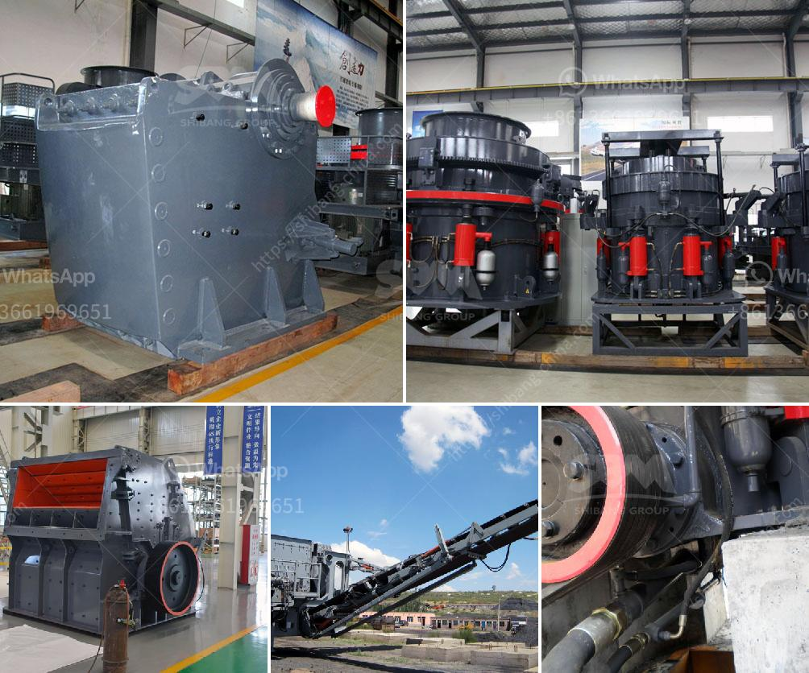

<h3>limestone plant machinery manufacturers sale tamilnadu</h3>
Limestone is a sedimentary rock composed mainly of calcium carbonate (CaCO3). It is widely used in various industries, including construction, agriculture, and manufacturing. The demand for limestone has been steadily increasing, leading to a rise in the number of limestone plant machinery manufacturers in Tamil Nadu, one of the major limestone-producing states in India. 

Tamil Nadu has a rich reserve of limestone, making it a prime location for limestone mining and processing plants. These plants require specialized machinery to extract, crush, and process limestone into different sizes and forms suitable for various industries. This has created a booming market for limestone plant machinery manufacturers in the state.

Limestone plant machinery manufacturers in Tamil Nadu provide a wide range of machinery and equipment to streamline the limestone extraction and processing operations. These manufacturers offer machines such as jaw crushers, impact crushers, vibrating feeders, vibrating screens, ball mills, and belt conveyors, among others. These machines are designed to efficiently extract limestone from mines, crush them into smaller sizes, and process them for various applications.

One of the key advantages of sourcing limestone plant machinery from Tamil Nadu is the presence of experienced manufacturers with in-depth knowledge of the local limestone industry. They understand the specific requirements of limestone processing plants and can provide customized machinery solutions that meet the needs of various applications. Additionally, sourcing machinery locally helps reduce transportation costs and ensures timely delivery of the equipment.

Limestone plant machinery manufacturers in Tamil Nadu also focus on ensuring the quality and durability of their machines. They use high-quality materials and employ advanced manufacturing techniques to produce robust machinery that can withstand the harsh conditions of limestone mining and processing. This ensures that the machinery works efficiently and has a longer lifespan, reducing maintenance and replacement costs for the end-users.

Furthermore, these manufacturers offer after-sales services, including installation, commissioning, and training. They have a team of technical experts who provide support and guidance during the setup of limestone processing plants. This helps streamline operations and ensures optimal performance of the machinery.

The limestone plant machinery industry in Tamil Nadu has witnessed significant growth in recent years due to the increasing demand for limestone in various sectors. As a result, several manufacturers have emerged, offering a wide range of machinery options to cater to the diverse needs of limestone processing plants. This competition has led to technological advancements, improved product quality, and competitive pricing, benefiting the end-users.

In conclusion, limestone plant machinery manufacturers in Tamil Nadu play a crucial role in meeting the growing demand for limestone in various industries. Their machinery solutions help extract, process, and supply limestone efficiently, ensuring optimal performance and productivity for limestone processing plants. The presence of experienced manufacturers and their focus on quality and after-sales services further enhance the value proposition of sourcing limestone plant machinery from Tamil Nadu.
<h3>Contact us</h3><ul><li><strong>Whatsapp:&nbsp;<a href="https://wa.me/8613661969651">+8613661969651</a></strong></li><li><a href="https://swt.shibang-china.com/?git&amp;zhl&amp;limestone plant machinery manufacturers sale tamilnadu"><strong>Online Service(chat now)</strong></a></li></ul><h3>Related</h3><ul><li><a href='marble powder crusher plant.md'>marble powder crusher plant</a></li><li><a href='turkey jaw crushers in istanbul.md'>turkey jaw crushers in istanbul</a></li><li><a href='granite and marble business plan pdf.md'>granite and marble business plan pdf</a></li><li><a href='wet grinding mill.md'>wet grinding mill</a></li><li><a href='petroleum coke mill.md'>petroleum coke mill</a></li></ul>