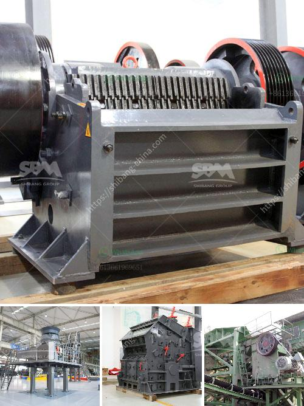

<h3>limestone powder mill in bankura</h3>
The cement industry has witnessed a significant transformation over the years, evolving from traditional methods to advanced technologies. Amongst these innovations, the limestone powder mill has emerged as a game-changer, especially in regions like Bankura where limestone is abundantly available.

Located in the western part of West Bengal, Bankura is known for its rich limestone reserves. This natural resource has been a vital component in the production of cement, which is the backbone of the construction industry. However, traditional methods of limestone extraction and processing were not only time-consuming but also environmentally detrimental.

Recognizing the need for an efficient and sustainable solution, several cement manufacturing companies in Bankura have invested in limestone powder mills. These mills use cutting-edge technology to grind limestone into fine powder, offering numerous advantages over traditional practices.

Firstly, the limestone powder mill significantly reduces the carbon footprint associated with cement production. Traditional methods involved burning large quantities of fossil fuels to heat the kilns for limestone calcination. In contrast, the powder mill utilizes advanced grinding techniques that require less energy input, therefore reducing greenhouse gas emissions.

Secondly, the limestone powder mill ensures maximum resource utilization. By grinding limestone into a fine powder, it becomes easier to extract valuable minerals present in the raw material. Traditionally, a significant portion of these minerals remained unused and was discarded as waste. However, with the powder mill, these minerals can be effectively utilized, not only improving the quality of the cement but also reducing overall waste generation.

Furthermore, the use of limestone powder in cement production offers several additional benefits. The powder acts as a filler, enhancing the cement's workability, reducing its water demand, and improving its overall strength. Moreover, limestone powder has pozzolanic properties, which means it can react with the calcium hydroxide produced during cement hydration, resulting in enhanced durability and reduced permeability.

Bankura's limestone powder mills have also positively impacted the local economy. The establishment of these mills has created employment opportunities for the local population, stimulating economic growth in the region. Additionally, the presence of limestone powder mills has attracted cement manufacturers from other regions, leading to further infrastructure development and investment in Bankura.

However, it is crucial to maintain a balance between industrial growth and environmental sustainability. Strict regulations and monitoring of the limestone extraction process should be in place to ensure responsible mining practices. Additionally, the cement industry should actively adopt eco-friendly technologies, such as effective waste management and the use of alternative fuels, to minimize its environmental impact.

In conclusion, the limestone powder mill has revolutionized the cement industry in Bankura, providing a sustainable and efficient alternative to traditional practices. This advanced technology not only reduces carbon emissions and waste generation but also enhances the quality and durability of cement. As the demand for construction materials continues to grow, Bankura's limestone powder mills play a vital role in meeting this demand while contributing to the region's economic development.
<h3>Contact us</h3><ul><li><strong>Whatsapp:&nbsp;<a href="https://wa.me/8613661969651">+8613661969651</a></strong></li><li><a href="https://swt.shibang-china.com/?git&amp;zhl&amp;limestone powder mill in bankura"><strong>Online Service(chat now)</strong></a></li></ul><h3>Related</h3><ul><li><a href='portable diamond processing plant supplier.md'>portable diamond processing plant supplier</a></li><li><a href='sample business plan for stone crusher in bolivia.md'>sample business plan for stone crusher in bolivia</a></li><li><a href='brick crusher for sale.md'>brick crusher for sale</a></li><li><a href='crusher plant for sale in south africa.md'>crusher plant for sale in south africa</a></li><li><a href='jaw crusher what price in china.md'>jaw crusher what price in china</a></li></ul>