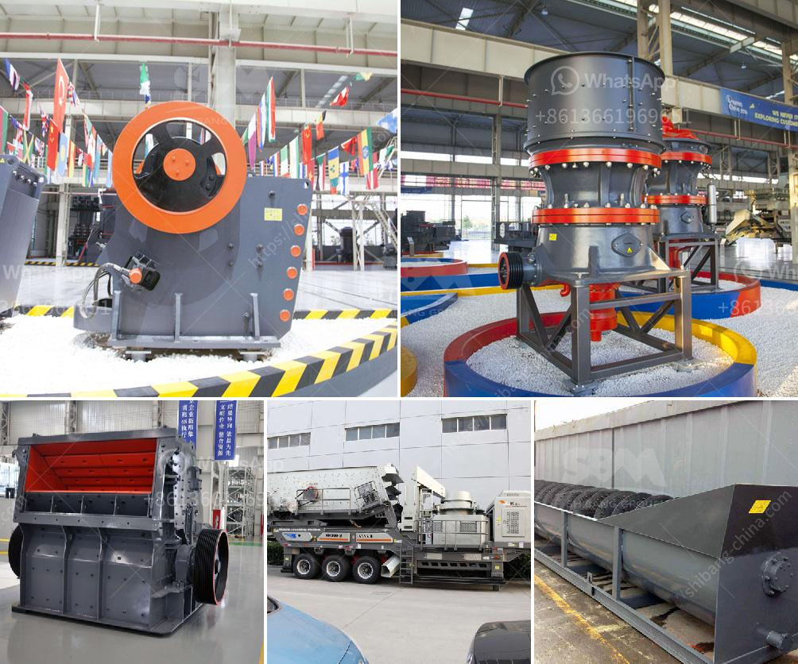

<h3>limestone powder production process</h3>
Limestone powder is widely used in various industries such as energy, construction, and agriculture due to its wide range of applications. It is an essential raw material for manufacturing cement, quicklime, calcium carbonate, and other industrial products.

The production process of limestone powder begins with the extraction of limestone from quarries or mines. After the limestone is crushed and ground to the suitable particle size, it is transferred to a lime kiln where it is heated to high temperatures. This process, known as calcination, results in the decomposition of limestone into lime and carbon dioxide.

The lime obtained from calcination is then further processed to obtain various forms of limestone powder. The most common method is to crush the burnt lime and grind it with water to make slaked lime. This slaked lime is dried and then milled to obtain a fine powder known as hydrated lime.

Alternatively, limestone powder can be produced by directly grinding limestone rocks. The mined limestone is crushed into small particles and then heated in a kiln to remove moisture, resulting in a dry, powdered form of limestone. This process is commonly used in the production of calcium carbonate powders used as fillers in the paper, paint, and plastic industries.

To ensure the quality of limestone powder, strict control measures are implemented throughout the production process. This includes the monitoring of raw materials, such as limestone quality and purity, as well as the control of grinding parameters to achieve the desired particle size distribution.

In conclusion, the production process of limestone powder involves the extraction of limestone, its calcination to obtain lime, and further processing to obtain various forms of limestone powder. The quality of the limestone powder is closely monitored to meet the requirements of different industries. As limestone powder continues to find innovative applications, the production process will continue to evolve to meet the growing demand.
<h3>Contact us</h3><ul><li><strong>Whatsapp:&nbsp;<a href="https://wa.me/8613661969651">+8613661969651</a></strong></li><li><a href="https://swt.shibang-china.com/?git&amp;zhl&amp;limestone powder production process"><strong>Online Service(chat now)</strong></a></li></ul><h3>Related</h3><ul><li><a href='ball mill suppliers china.md'>ball mill suppliers china</a></li><li><a href='mini stone crusher machine cost mill.md'>mini stone crusher machine cost mill</a></li><li><a href='feasibility study for cocoa unit processing.md'>feasibility study for cocoa unit processing</a></li><li><a href='complete crushing for sale with price.md'>complete crushing for sale with price</a></li><li><a href='cost of limestone crusher plant.md'>cost of limestone crusher plant</a></li></ul>