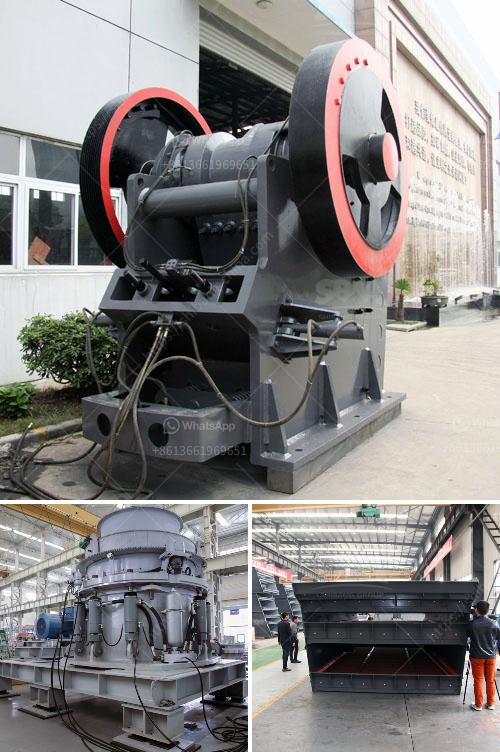

<h3>limestone production machinery</h3>
Limestone is a sedimentary rock composed mostly of the mineral calcite, which is a form of calcium carbonate. The calcium carbonate content in limestone often varies from 75% to 95%. It is a widely used building material and industrial raw material for many industries, such as cement, agriculture, paints, adhesives, and construction.

Limestone production requires efficient machinery that can handle the heavy-duty tasks involved in mining and processing. To meet the industry's demands, manufacturers have developed specialized equipment that can withstand the challenges of limestone production.

One essential piece of machinery in limestone production is the crusher. A crusher is used to reduce the size, shape, and consistency of limestone into manageable chunks. Crushers are typically jaw crushers or impact crushers that utilize mechanical force to break down the larger rocks into smaller pieces.

Once crushed, the limestone is then transported to a limestone mill for further processing. A limestone mill, also known as a Raymond mill, is a type of grinding mill that is used to grind limestone into a powder. The powder can then be used in various applications, such as in the production of cement or as a soil conditioner in agriculture.

Another piece of essential machinery in limestone production is a limestone kiln. The kiln is used to convert limestone into lime through a process called calcination. During calcination, limestone is heated at high temperatures (around 900-1000°C) in a controlled environment, which causes it to undergo chemical changes. The end product, lime, is commonly used in steel manufacturing, water treatment, and construction.

To ensure efficient limestone production, manufacturers have incorporated various technological advancements into their machinery. For example, some crushers and mills are equipped with energy-saving features that reduce power consumption while maintaining productivity levels. Additionally, remote monitoring systems and automation technologies have been implemented to streamline production processes and minimize human error.

The optimization of machinery design and performance is an ongoing effort within the limestone production industry. Manufacturers are continually researching and developing new equipment that can improve efficiency, increase production capacity, and reduce environmental impact. Innovations such as advanced crushing technologies, improved grinding mills, and eco-friendly kilns are being introduced to the market to meet the evolving demands of limestone production.

In conclusion, limestone production machinery plays a crucial role in mining and processing limestone. From crushers that break down the rocks to mills that grind them into a powder, each piece of equipment is specially designed to handle the challenges of limestone production. With ongoing research and development, manufacturers continue to improve machinery designs, making the production process more efficient and environmentally friendly. As limestone remains an essential raw material in various industries, the demand for advanced machinery will continue to grow.
<h3>Contact us</h3><ul><li><strong>Whatsapp:&nbsp;<a href="https://wa.me/8613661969651">+8613661969651</a></strong></li><li><a href="https://swt.shibang-china.com/?git&amp;zhl&amp;limestone production machinery"><strong>Online Service(chat now)</strong></a></li></ul><h3>Related</h3><ul><li><a href='used conical crushers for sale.md'>used conical crushers for sale</a></li><li><a href='aggregate crushing plant sale.md'>aggregate crushing plant sale</a></li><li><a href='mineral that is used to make talcum powder.md'>mineral that is used to make talcum powder</a></li><li><a href='sand screening plants in south africa.md'>sand screening plants in south africa</a></li><li><a href='grinding mill machine for sale.md'>grinding mill machine for sale</a></li></ul>