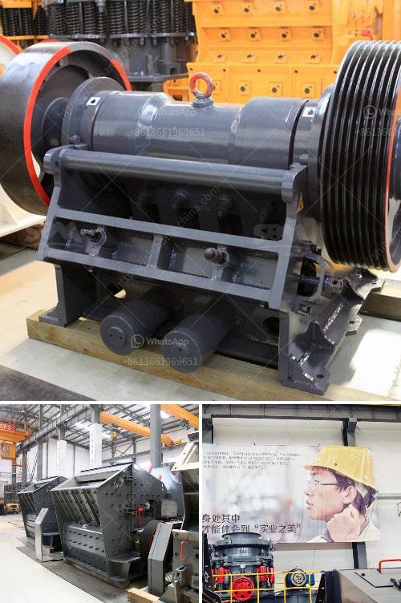

<h3>limestone production mining equipment for sale</h3>
Limestone is a sedimentary rock composed mostly of calcium carbonate in the form of calcite or aragonite. It is one of the most commonly used types of rock for construction purposes, mainly because of its versatility and strength. As a result, limestone production and mining have become a thriving industry around the world.

In order to extract limestone from the ground, it is first blasted from quarries in large blocks. The limestone extracted is then crushed and processed into various sizes for different applications such as road base, concrete aggregate, and as a flux in iron and steel production. This process requires efficient and reliable mining equipment to ensure the smooth and trouble-free operation of limestone production facilities.

One of the key equipment used in this process is the heavy-duty track-mounted jaw crusher. This robust machine is designed specifically for limestone processing, using a large heavy-duty jaw crusher with an impressive crushing capacity. This allows it to handle even the largest limestone blocks with ease and produce high-quality aggregate for a wide range of applications.

Another essential equipment in the limestone production line is the mill. Usually used for processing non-metallic minerals such as limestone, calcium carbonate, and limestone powder, this machine grinds the raw material into a fine powder. It is widely used in the cement industry, mining industry, chemical industry, and other fields.

To ensure efficient limestone production, it is essential to have a reliable screening equipment. The vibrating screen is a crucial piece of equipment that is used to separate materials of different sizes and ensure that only the desired size of limestone is sent to the next stage of the production process. This not only improves the efficiency of the process but also ensures a consistent product quality.

Additionally, conveyor systems play a vital role in limestone production. These systems transport the crushed limestone from one processing stage to another, making the overall production process more efficient and cost-effective. They also enable the quick and easy transfer of limestone from the quarry to the processing facility, minimizing downtime and maximizing productivity.

In recent years, there has been an increasing demand for more environmentally friendly mining equipment. As a result, many manufacturers have introduced energy-efficient and emission-reducing equipment options. These advancements in technology not only benefit the environment but also help to reduce operating costs and improve overall sustainability in the limestone production industry.

In conclusion, limestone production and mining have become indispensable industries in many parts of the world. To ensure efficient and profitable operations, it is essential to invest in reliable and high-quality mining equipment. From crushing and milling machines to screening and conveyor systems, there are various types of equipment available for sale to meet the specific needs of limestone production facilities. By choosing the right equipment, operators can maximize productivity, reduce downtime, and produce high-quality limestone products that meet industry standards.
<h3>Contact us</h3><ul><li><strong>Whatsapp:&nbsp;<a href="https://wa.me/8613661969651">+8613661969651</a></strong></li><li><a href="https://swt.shibang-china.com/?git&amp;zhl&amp;limestone production mining equipment for sale"><strong>Online Service(chat now)</strong></a></li></ul><h3>Related</h3><ul><li><a href='sand manufacturing small scale.md'>sand manufacturing small scale</a></li><li><a href='portable limestone crushing systems.md'>portable limestone crushing systems</a></li><li><a href='iron slag crushing ball mill in nagpur.md'>iron slag crushing ball mill in nagpur</a></li><li><a href='process of talcum powder mill.md'>process of talcum powder mill</a></li><li><a href='crusher machine in gujranwala location.md'>crusher machine in gujranwala location</a></li></ul>