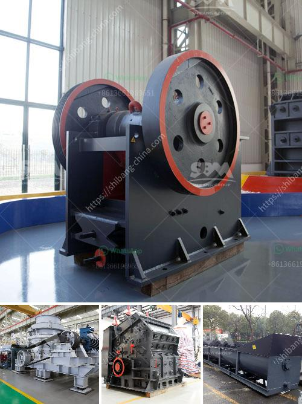

<h3>list iron ore crusher plants in india</h3>
India is one of the leading producers of iron ore in the world. The majority of iron ore deposits in India are found in the states of Odisha, Jharkhand, Chhattisgarh, and Karnataka. As per recent industry estimates, the total iron ore reserves in India are around 25 billion tons. The country is also the largest producer of sponge iron in the world.

To extract iron ore from the mines, it is first crushed and then undergoes various processes such as grinding, beneficiation, and pelletization before it is finally used for the production of steel. The iron ore crusher plants in India have the potential to increase the country's annual production capacity by millions of tons if utilized effectively.

1. Odisha: The state accounts for about 35% of India's total iron ore reserves. It is also the largest producer and exporter of iron ore in the country. The iron ore crusher plants are located in and around the Barbil-Joda region of Keonjhar district in the state. The steel plants that are operational in the region are Bhusan Steel, Tata Steel, Usha Martin, and Jindal Steel.

2. Jharkhand: The state of Jharkhand in Eastern India is known for its rich deposits of iron ore. The major iron ore crusher plants are located in Singhbhum district of Jharkhand. The steel plants that are operational in the region are Tata Steel, SAIL, and Electrosteel.

3. Chhattisgarh: Chhattisgarh is the largest producer of sponge iron in India. The iron ore crusher plants are located in Bailadila region of Bastar district. The steel plants that are operational in Chhattisgarh are Bhilai Steel Plant, Salem Steel Plant, and Visakhapatnam Steel Plant.

4. Karnataka: The state of Karnataka is also a major producer of iron ore in India. The iron ore crusher plants are located in Hospet, Bellary, and Chitradurga districts of Karnataka. The steel plants that are operational in the region are JSW Steel, Kirloskar Ferrous, and JSW Steel.

In conclusion, India has significant iron ore reserves scattered across various states. The establishment of iron ore crusher plants in these regions will not only boost the country's production capacity but also provide employment opportunities in the mining and steel industries. With proper utilization and sustainable mining practices, India can become a major player in the global iron ore market.
<h3>Contact us</h3><ul><li><strong>Whatsapp:&nbsp;<a href="https://wa.me/8613661969651">+8613661969651</a></strong></li><li><a href="https://swt.shibang-china.com/?git&amp;zhl&amp;list iron ore crusher plants in india"><strong>Online Service(chat now)</strong></a></li></ul><h3>Related</h3><ul><li><a href='brick making business plan pdf.md'>brick making business plan pdf</a></li><li><a href='jaw crusher south africa used.md'>jaw crusher south africa used</a></li><li><a href='stone crushing in pakistan.md'>stone crushing in pakistan</a></li><li><a href='how much investment needed to start a crusher in canada.md'>how much investment needed to start a crusher in canada</a></li><li><a href='vibrating screen estimating.md'>vibrating screen estimating</a></li></ul>