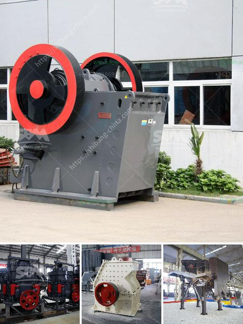

<h3>list of compartment of gypsum crusher plant</h3>
Gypsum is a common mineral found in many places around the world. The primary use of gypsum is in the construction industry, where it is utilized to produce plaster and plasterboard. Gypsum is also used as a soil additive for agricultural purposes. In order to process gypsum into a usable form, a gypsum crusher plant is essential.

Gypsum is a soft mineral, commonly produced by the evaporation of seawater. It is usually the last mineral to precipitate from solution during evaporation, which means it can take quite a long time to form large deposits of gypsum. The process starts by extracting gypsum rock deposits from the ground using a ‘JOY mine cutter’ that scores away at the face of the gypsum rock. This is then loaded onto trucks and transported to the crushing and grinding plant. The crusher grinds the gypsum rock into fine raw powder, which is then heated to remove any remaining moisture that might be present. The resulting plaster of Paris is then mixed with water to create plasterboard.

The gypsum crusher plant is composed of primary crushing system, secondary crushing system, feeder and screening system, and belt conveying system, which are all interconnected in a complex of required equipment to complete the crushing and screening tasks.

The primary crusher system consists of a feed hopper, apron feeder, primary sizer crusher, and discharge conveyor. The hopper is mainly used to store the gypsum rock and feed the crusher with the required material. Secondary crushing system

The secondary crusher is a significant part of the gypsum crusher plant. It is designed to crush the main raw material, which is further enhanced with other additives like silica, clay, and iron ore.

A feeder is an essential part of the gypsum crusher plant, which moves the large rocks to the crusher manufacturer's specifications. The screening system separates oversized particles from the smaller ones. Belt conveying system

After being crushed, the gypsum rock is then loaded onto a conveyor belt that carries it to the storage bin for further processing. The entire process can be completed in a matter of minutes.

The gypsum crusher plant is an important part of the current gypsum processing system. The grinding mill production line is the main equipment for processing gypsum powder. The grinding mill performs well in the gypsum powder production line, and is welcomed by the market, with a considerable number of investors. If you want to learn more about the gypsum crusher plant, you can contact us online, and we will answer your questions in a timely manner.
<h3>Contact us</h3><ul><li><strong>Whatsapp:&nbsp;<a href="https://wa.me/8613661969651">+8613661969651</a></strong></li><li><a href="https://swt.shibang-china.com/?git&amp;zhl&amp;list of compartment of gypsum crusher plant"><strong>Online Service(chat now)</strong></a></li></ul><h3>Related</h3><ul><li><a href='ballast crusher supplier.md'>ballast crusher supplier</a></li><li><a href='ball india ball mills 220 tph.md'>ball india ball mills 220 tph</a></li><li><a href='egypt gypsum powder manufacturer.md'>egypt gypsum powder manufacturer</a></li><li><a href='cement production plant.md'>cement production plant</a></li><li><a href='industrial application of ball mills.md'>industrial application of ball mills</a></li></ul>