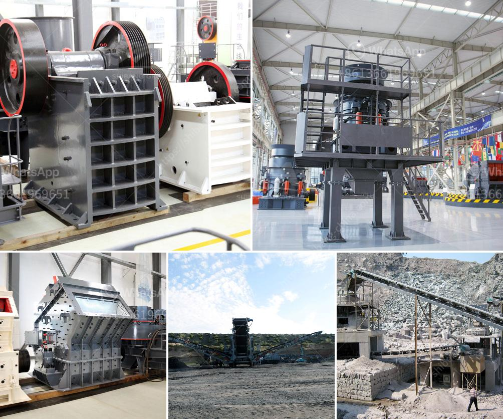

<h3>list of machinery used in the quarry</h3>
A quarry is a site where materials such as stone, rock, gravel, limestone, sand, and other minerals are extracted from the Earth. These materials are used to create various products for construction and other uses. In order to extract these valuable resources, a range of machinery is used in the quarry. This article will explore the different types of machinery used in the quarry and their purposes.

1. Excavators: Excavators are heavy machinery that are used to dig and remove large amounts of soil, rocks, or other materials from the quarry. They are equipped with a bucket that can be attached to the front or arm of the excavator, allowing for efficient digging and loading of materials onto trucks or other transportation vehicles.

2. Bulldozers: Bulldozers are powerful machines that are used to move and push materials such as soil, gravel, or rocks. They are often used to clear the quarry site or level the ground before extraction begins. Bulldozers are equipped with a large blade in the front that can be used to push materials or create roads and paths within the site.

3. Wheel loaders: Wheel loaders are versatile machines that are used to load materials onto trucks or transport them within the quarry. They are equipped with a front bucket that can be used to scoop and lift heavy materials. Wheel loaders are often used to transport materials such as gravel or rocks to the processing plant or loading area.

4. Crushers: Crushers are the machinery used to crush large rocks or other materials into smaller pieces or gravel for construction purposes. They come in different types such as jaw crushers, gyratory crushers, or cone crushers, depending on the shape and size of the material to be crushed.

5. Conveyors: Conveyors are used to transport materials within the quarry site. They consist of a continuous belt that moves materials from one location to another. Conveyors are used to move materials such as rocks, gravel, or sand from the extraction point to the processing plant or loading area.

6. Drilling equipment: Drilling equipment is used to create boreholes or wells in the quarry site for the extraction of materials. This equipment can range from small handheld drills to large drilling rigs. Drilling is necessary for extracting minerals such as limestone, which are buried deep within the Earth's surface.

7. Dump trucks: Dump trucks are commonly used in quarries to transport materials from the extraction site to the processing plant or loading area. These trucks are equipped with a rear dump bed that can be lifted hydraulically to unload the materials. Dump trucks come in various sizes, with larger trucks capable of carrying heavier loads.

In conclusion, a quarry requires a range of machinery to extract materials from the Earth's surface. Excavators, bulldozers, wheel loaders, crushers, conveyors, drilling equipment, and dump trucks are some of the machinery used in the quarry. Each machine plays a vital role in the extraction and transportation of materials, allowing for efficient and productive quarry operations.
<h3>Contact us</h3><ul><li><strong>Whatsapp:&nbsp;<a href="https://wa.me/8613661969651">+8613661969651</a></strong></li><li><a href="https://swt.shibang-china.com/?git&amp;zhl&amp;list of machinery used in the quarry"><strong>Online Service(chat now)</strong></a></li></ul><h3>Related</h3><ul><li><a href='south africa crusher sale.md'>south africa crusher sale</a></li><li><a href='quartz stone powder machine manufacturing in india.md'>quartz stone powder machine manufacturing in india</a></li><li><a href='bentonite crushing machine price list.md'>bentonite crushing machine price list</a></li><li><a href='hammer mill gauteng.md'>hammer mill gauteng</a></li><li><a href='mobile crushers zenith.md'>mobile crushers zenith</a></li></ul>