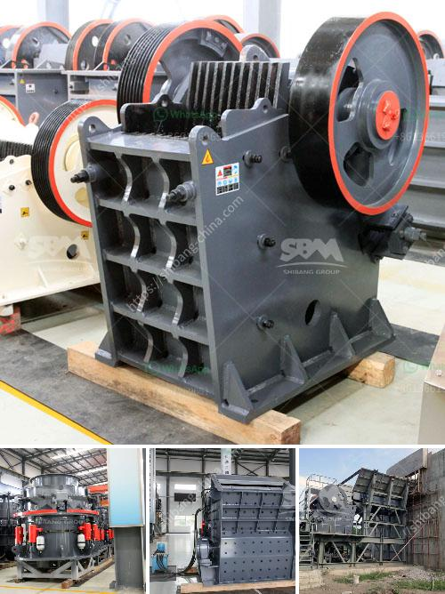

<h3>looking for a partner for machinery crusher</h3>
In the increasingly competitive and demanding world of industrial machinery, finding the right partner for your machinery crusher becomes crucial. A machinery crusher, also known as a crusher machine, is a device primarily used for crushing various types of materials, including rocks, minerals, and concrete. These machines play a vital role in industries such as mining, construction, and recycling, as they are frequently used to break down materials into smaller, more manageable pieces.

Finding the perfect partner for your machinery crusher can be a daunting task. With numerous manufacturers and suppliers to choose from, it's important to consider various factors before making a decision. Factors such as price, quality, reliability, and after-sales service should all be taken into account.

One of the first things to consider when searching for a partner is the price. While it may be tempting to opt for the cheapest option, it's important to remember that quality often comes at a cost. Investing in a reliable and efficient machinery crusher may save you money in the long run by reducing downtime and operating costs. Furthermore, choosing a partner that offers competitive pricing with a transparent breakdown of costs will provide peace of mind and help you plan your budget effectively.

Quality is another crucial factor in selecting a partner for your machinery crusher. A high-quality crusher machine will be built to withstand the rigors of heavy-duty use, ensuring longevity and optimal performance. Look for partners who have a reputation for producing durable and efficient machinery crushers. Reading customer reviews and seeking recommendations from industry experts will provide valuable insights into the quality of the equipment.

Reliability is key when it comes to machinery crushers. The last thing any business owner wants is a crusher that frequently breaks down, causing costly delays in operations. Reliable partners will offer machinery crushers that are robust and have undergone rigorous testing to ensure their efficiency and durability. It's also worth looking for partners who provide a warranty or guarantee, as this demonstrates their commitment to customer satisfaction.

After-sales service is an often overlooked but vital aspect of choosing a partner for your machinery crusher. Even the most reliable crushers can experience occasional issues or require routine maintenance. Partnering with a company that offers prompt and reliable after-sales service will minimize downtime and ensure that any problems are swiftly resolved. Look for partners who provide comprehensive customer support, including technical assistance, spare parts, and on-site maintenance visits.

Additionally, it can be beneficial to choose a partner that offers customization options for your machinery crusher. Every industry has unique requirements, and having a crusher machine tailored to your specific needs can greatly enhance productivity and efficiency. Customizable features may include adjustable settings, different sizes and capacities, as well as the option to integrate additional components or technologies.

In conclusion, finding the right partner for your machinery crusher is a decision that should be made with careful consideration of various factors. Price, quality, reliability, after-sales service, and customization options should all be taken into account. By partnering with a reputable and reliable company, you can ensure that your machinery crusher meets your specific needs, maximizes productivity, and delivers long-term value to your business.
<h3>Contact us</h3><ul><li><strong>Whatsapp:&nbsp;<a href="https://wa.me/8613661969651">+8613661969651</a></strong></li><li><a href="https://swt.shibang-china.com/?git&amp;zhl&amp;looking for a partner for machinery crusher"><strong>Online Service(chat now)</strong></a></li></ul><h3>Related</h3><ul><li><a href='products mobile cone crusher.md'>products mobile cone crusher</a></li><li><a href='talc mineral processing.md'>talc mineral processing</a></li><li><a href='german made stone crushers.md'>german made stone crushers</a></li><li><a href='complete crushing for sale with price.md'>complete crushing for sale with price</a></li><li><a href='want to lease diamond mining equipment in south africa.md'>want to lease diamond mining equipment in south africa</a></li></ul>