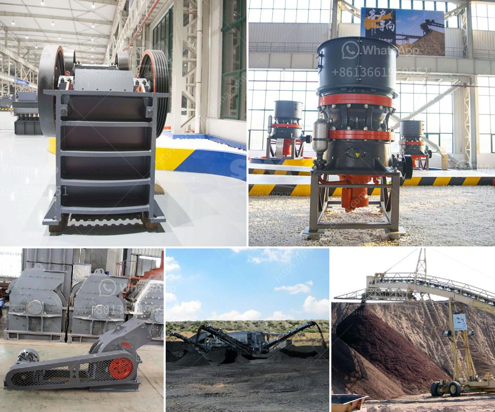

<h3>low price second hand jaw crusher popular in zambia</h3>
In the mining and construction industry, the jaw crusher at the forefront has been widely used due to its powerful crushing capabilities. Its popularity is further enhanced by its availability as a cost-effective second-hand option in Zambia. This article explores why low-price second-hand jaw crushers have become increasingly popular in the country, attracting both local businesses and international mining companies.

One of the main reasons second-hand jaw crushers are popular in Zambia is the affordability factor. These crushers can be significantly cheaper than brand new ones, offering an attractive alternative for organizations with limited budgets. Thanks to their robust design and durability, second-hand jaw crushers still deliver high-performance crushing, maintaining their reliability and efficiency.

Zambia's rich mineral reserves, including copper, gold, and other precious metals, have attracted significant attention from mining companies worldwide. As a result, the demand for jaw crushers, which are essential equipment in the extraction process, has surged in recent years. To keep up with this demand and minimize costs, many companies opt for low-price second-hand jaw crushers over expensive new models.

Zambia's rugged terrain and variable climate can pose challenges for machinery used in mining and construction. Second-hand jaw crushers that have already been tested in local conditions are often found to adapt better, proving their worth in Zambia's demanding operational environments. Moreover, these crushers are readily available, saving valuable time when prompt replacements are needed.

Opting for second-hand machinery has an added advantage for promoting sustainable development. By extending the lifespan of equipment through reuse, valuable resources are conserved, and the environmental impact of mining activities is minimized. This aligns with Zambia's efforts to balance economic growth and environmental conservation, making low-price second-hand jaw crushers an appealing choice.

Low-price second-hand jaw crushers have undoubtedly gained popularity in Zambia's mining and construction industry. Their affordability, reliability, suitability for local operating conditions, and contribution to sustainable development have made them an attractive option for businesses seeking cost-effective and efficient crushing solutions. As the demand for minerals continues to grow, these crushers will likely remain a sought-after choice for mining companies operating in Zambia.
<h3>Contact us</h3><ul><li><strong>Whatsapp:&nbsp;<a href="https://wa.me/8613661969651">+8613661969651</a></strong></li><li><a href="https://swt.shibang-china.com/?git&amp;zhl&amp;low price second hand jaw crusher popular in zambia"><strong>Online Service(chat now)</strong></a></li></ul><h3>Related</h3><ul><li><a href='what is the dam ring in vertical rollers mill.md'>what is the dam ring in vertical rollers mill</a></li><li><a href='coal washing plant for sale.md'>coal washing plant for sale</a></li><li><a href='sell jaw crusher the dubia.md'>sell jaw crusher the dubia</a></li><li><a href='jaw crusher in uganda.md'>jaw crusher in uganda</a></li><li><a href='ball mill manufacturer in bhayander.md'>ball mill manufacturer in bhayander</a></li></ul>