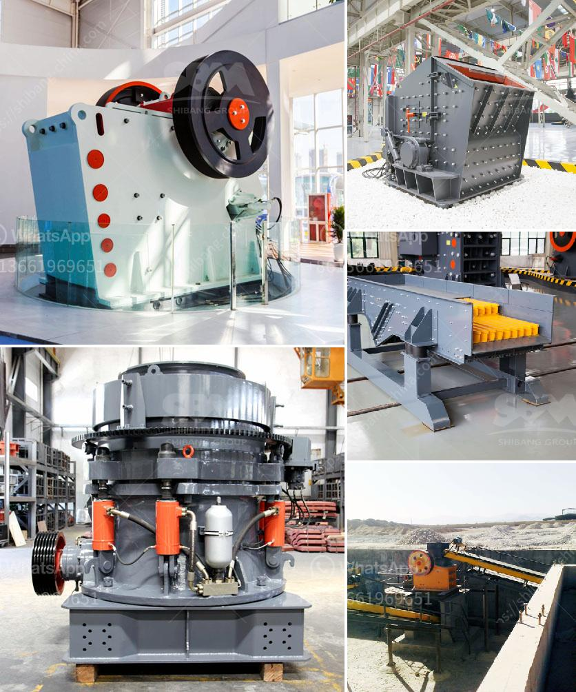

<h3>machine of ultra fine mills</h3>
The machine of ultra-fine mills, also known as micro powder mills or ultrafine grinding mills, is a state-of-the-art technology developed by a team of experts in the field of milling machinery. This machinery is widely used in the fields of mining, metallurgy, chemical engineering, building materials, and many others, providing high-quality and efficient grinding solutions for various materials.

The ultra-fine mill is designed to produce extremely fine powders, typically ranging from 200 to 2500 mesh. This level of fineness is achieved through the use of special equipment, such as the ultra-fine grinder or the ball mill, which breaks down the particles to the desired size. The machine operates on the principle of impact and attrition, crushing and grinding the materials into ultra-fine powders.

One of the key advantages of the ultra-fine mill is its high efficiency. The machine is equipped with advanced technology, including the latest air classifier system, which allows for precise control of particle size distribution. This ensures that the final product is of consistent quality, with minimal variations in particle size. Additionally, the machine is designed to operate with low energy consumption, resulting in lower production costs.

Another notable feature of the ultra-fine mill is its versatility. The machine is capable of grinding a wide range of materials, from soft to hard, including various minerals, ores, and chemicals. This makes it a valuable tool in many industries, such as pharmaceuticals, ceramics, and paint manufacturing, where ultra-fine powders are required for specific applications.

The ultra-fine mill also offers a number of unique features that contribute to its popularity. For example, it is equipped with a dust collector system, which effectively removes airborne particles, ensuring a cleaner and healthier working environment. Additionally, the machine is equipped with a noise reduction system, minimizing noise pollution during operation. These features not only improve the working conditions but also enhance the overall user experience.

The maintenance of the ultra-fine mill is relatively simple, requiring regular cleaning and lubrication. The machine is robustly built with durable materials, ensuring a long lifespan and reliable performance. Furthermore, the machine is designed to be user-friendly, with intuitive controls and a clear interface, enabling operators to easily adjust and monitor the grinding process.

In conclusion, the machine of ultra-fine mills is a cutting-edge technology that offers high-quality and efficient grinding solutions for various industries. Its ability to produce ultra-fine powders with precise particle size distribution, combined with its versatility and ease of maintenance, make it a valuable asset for any manufacturing operation. Whether it is used in mining, chemical engineering, or other fields, the ultra-fine mill provides exceptional performance and high productivity.
<h3>Contact us</h3><ul><li><strong>Whatsapp:&nbsp;<a href="https://wa.me/8613661969651">+8613661969651</a></strong></li><li><a href="https://swt.shibang-china.com/?git&amp;zhl&amp;machine of ultra fine mills"><strong>Online Service(chat now)</strong></a></li></ul><h3>Related</h3><ul><li><a href='mobile stone crusher in.md'>mobile stone crusher in</a></li><li><a href='hammer vibrating screens usa.md'>hammer vibrating screens usa</a></li><li><a href='crush cobble machine.md'>crush cobble machine</a></li><li><a href='cde sand washing plant price.md'>cde sand washing plant price</a></li><li><a href='coal grinding mill in india.md'>coal grinding mill in india</a></li></ul>