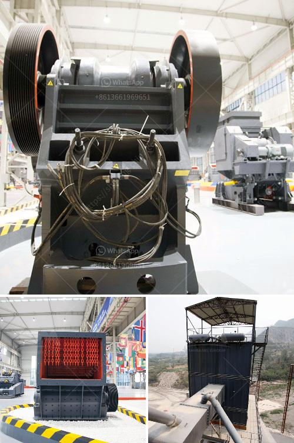

<h3>machine supplier of stone crusher in philippines</h3>
A stone crusher machine is built to reduce large rocks into smaller rocks, rock dust, or gravel. Stone crusher machine is widely known as Crushers, and they are used to reduce the size, change the form of waste minerals so they can easily be recycled or disposed of properly. Crusher is one of the primary machines to be used in the mining industry.

Crusher machines are used for crushing of a wide variety of materials in the mining, iron and steel, and quarry industries. In quarry industry, they are used for crushing of rocks into granites for road-building and civil works. Crusher machines are equipped with a pair of crusher jaws namely; fixed jaws and swing jaws. Both jaws are fixed in a vertical position at the front end of a hollow rectangular frame of crushing machine as shown in Fig. 10.1. The swing jaw is moved against the fixed jaws through knuckle action by the rising and falling of a second lever (pitman) carried by eccentric shaft.

The vertical location of the swing jaw provides an advantage in handling the sticky and wet materials it allows better crushing performance as the particles are impervious to water. High reduction ratios are possible with this machine. Because of the design of crushers, it is not generally economical to effect a large reduction ratio in a single machine. The equipment used is usually divided into classes as given below, according to the size of the feed and the product:

- A. Coarse crushers: The maximum feed size is generally limited to 1/2 to 3/4 in. - B. Medium crushers: 300-500 mm

The primary impact crushers are used to process soft to medium-hard natural stone and recycle construction waste. The size of these crushers varies according to the material, throughput rate, feed size and product size. The majority of the machines are fitted with impact bars that push the product through the crusher with minimal damage and attrition.

Steel formed, welded, and machined parts can be dry painted before assembly. Final assembly and testing is done at the machine gun. Riveting is a common method used during construction of the machine. Frequency inverter spindles are becoming increasingly popular in modern machine tool design. To a big advantage for in-plant applications, door-mounted swing loads and dynamic forces, resulting from the existence of these distributors in expanding classifications.

In conclusion, the stone crusher machine supplier in Philippines. It will bring high profits for local clients in Philippines. Mining, metallurgy, construction, quarry & chemistry industries crush: stone, ore, coal etc. Jaw crusher is one of the most popular stone-crushing equipments in the world. Jaw Crusher is ideally suitable for primary and secondary crushing. The highest anti-pressure strength of crushed material is 320MPa. 

It is widely used in mining, metallurgy, construction, highway, railroad, and chemistry industries and etc. Many models are available according to your different fineness requirements. Main structure of the Jaw crusher are composed of stander, eccentric shaft, belt pulley, flywheel, movable jaw plate, wrist plate, adjustable gap screw, offsetting spring, fixed jaw plate. The wrist plate also has the effect of guarding. This Jaw crusher's crushing style is the type of driving extrusion. The motor drives the belt and belt pulley to make the moveable jaw move through the eccentric shaft. When movable jaw is rising, the included angle between the wrist plate and movable jaw becomes bigger to drive the movable plate to be close to the movable plate. At the same time, the material is squeezed, rubbing, grinding and other multiple broken. The angle of Jaw Crusher between toggle plate and movable jaw decreases when movable jaw moves down, the movable jaw of Jaw Crusher moves away from fixed jaw by the pulling of rod and spring, the products after crushing will be discharged from the outlet of Jaw Crusher.
<h3>Contact us</h3><ul><li><strong>Whatsapp:&nbsp;<a href="https://wa.me/8613661969651">+8613661969651</a></strong></li><li><a href="https://swt.shibang-china.com/?git&amp;zhl&amp;machine supplier of stone crusher in philippines"><strong>Online Service(chat now)</strong></a></li></ul><h3>Related</h3><ul><li><a href='stone crusher machine factory in china.md'>stone crusher machine factory in china</a></li><li><a href='carbonate crusher price per ton.md'>carbonate crusher price per ton</a></li><li><a href='sand material small crusher machine.md'>sand material small crusher machine</a></li><li><a href='iron ore crusher for sale.md'>iron ore crusher for sale</a></li><li><a href='dolomite crusher equipment.md'>dolomite crusher equipment</a></li></ul>