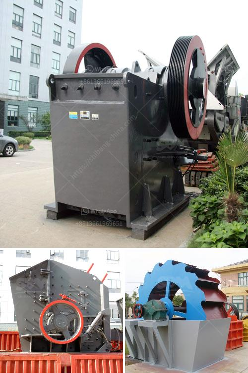

<h3>machine to crush quartz into powder</h3>
Quartz is one of the most abundant minerals on Earth. It exists in various forms like quartz sand, quartzite and quartz crystals. Quartz is the main component in manufacturing glass and creating a wide range of products. Due to its abundance and versatility, quartz is widely used across multiple industries. However, to make use of quartz in its purest form, it needs to be crushed into a fine powder. This is where a machine to crush quartz into powder comes in.

A machine specifically designed to break down quartz into powder is used in many places. It is employed in various industries such as mining, construction, ceramics, and even in the pharmaceutical industry. The machine, aptly named a quartz crusher, crushes the quartz into powder form by applying compressive force.

The use of machines to crush quartz into powder is a relatively new concept. As such, only a handful of companies in the world specialize in producing these machines. However, due to the increasing demand for quartz powder, the need for such machines is rising.

The process of crushing quartz into powder begins with the extraction of the quartz from the earth. The quartz is then transported to crushing machinery, usually big jaw crushers, that crush the quartz into smaller pieces. The crushed quartz particles are then fed to a vibrating screen where they are separated according to size. The bigger particles are returned to the crushers for further crushing until the desired size is achieved.

Once the quartz is crushed into powder, it can be used in various applications. The main use of quartz powder is in the manufacturing of glass. By mixing quartz powder with other components like soda and lime, it acts as a flux for the glass, helping it melt at lower temperatures and giving it its desired properties.

Moreover, quartz powder is also used in making ceramics. It adds strength and durability to the ceramic products. Additionally, quartz powder is utilized in the production of paints, abrasives, and even in electronic components.

In conclusion, the machine to crush quartz into powder plays a crucial role in various industries. It enables the extraction and processing of quartz into a fine powder, which is essential for manufacturing various products. As the demand for quartz powder continues to rise, the need for efficient and reliable machines will also increase. Thus, manufacturers and researchers must continue to enhance and innovate the technology behind these crushing machines.
<h3>Contact us</h3><ul><li><strong>Whatsapp:&nbsp;<a href="https://wa.me/8613661969651">+8613661969651</a></strong></li><li><a href="https://swt.shibang-china.com/?git&amp;zhl&amp;machine to crush quartz into powder"><strong>Online Service(chat now)</strong></a></li></ul><h3>Related</h3><ul><li><a href='slag cement manufacturing process youtube.md'>slag cement manufacturing process youtube</a></li><li><a href='ball mill in romania italy.md'>ball mill in romania italy</a></li><li><a href='gold wash plant for sale canada.md'>gold wash plant for sale canada</a></li><li><a href='used vsi crusher for sale in india.md'>used vsi crusher for sale in india</a></li><li><a href='crushing and screening simulation software.md'>crushing and screening simulation software</a></li></ul>