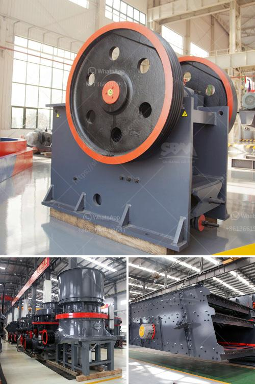

<h3>machines used for mining gypsum</h3>
Gypsum is a mineral commonly found in sedimentary deposits, often associated with other minerals such as halite (salt) and sulfur. It is widely used as a construction material due to its excellent fire resistance, sound absorption properties, and overall durability. The demand for gypsum in various industries, including construction, agriculture, and manufacturing, has led to the development of specialized mining machines to extract this valuable resource efficiently.

One of the most commonly used machines for gypsum mining is a continuous miner. This machine uses a rotating drum equipped with tungsten carbide teeth to scrape the mineral from the underground deposit. The continuous miner can extract up to 30 tons of gypsum per hour, making it a vital tool in the mining industry.

After the continuous miner extracts the gypsum, it is conveyed to a crusher for size reduction. The crusher breaks down the gypsum into small pieces suitable for further processing. This process is crucial as it allows for easier handling and transportation of the mineral.

Another important machine used for gypsum mining is a high-pressure water pump. This machine is used to create a hydraulic slurry that can be used to transport the gypsum through pipelines or to wash away unwanted impurities from the mineral. The high-pressure water pump ensures efficient mining operations by providing the necessary pressure to move the gypsum and maintain a smooth workflow.

Furthermore, various types of loaders and haul trucks are used in gypsum mining to transport the mineral from the extraction site to the processing facility or storage area. Loaders are used to scoop up the gypsum and load it onto the haul trucks, which can carry large quantities of the mineral over long distances.

In conclusion, the mining of gypsum requires specialized machines to extract, process, and transport this valuable mineral. Continuous miners, crushers, high-pressure water pumps, loaders, and haul trucks are just some of the machinery used in the mining industry to ensure the efficient extraction and utilization of gypsum. These machines play a critical role in meeting the demand for gypsum in various industries and contribute to the economic growth of mining regions globally.
<h3>Contact us</h3><ul><li><strong>Whatsapp:&nbsp;<a href="https://wa.me/8613661969651">+8613661969651</a></strong></li><li><a href="https://swt.shibang-china.com/?git&amp;zhl&amp;machines used for mining gypsum"><strong>Online Service(chat now)</strong></a></li></ul><h3>Related</h3><ul><li><a href='almada crusher machine in mumbai.md'>almada crusher machine in mumbai</a></li><li><a href='calcium carbonate plant.md'>calcium carbonate plant</a></li><li><a href='movable crushing plant.md'>movable crushing plant</a></li><li><a href='mobile plant sand screen for sale.md'>mobile plant sand screen for sale</a></li><li><a href='250tph cone crusher price.md'>250tph cone crusher price</a></li></ul>