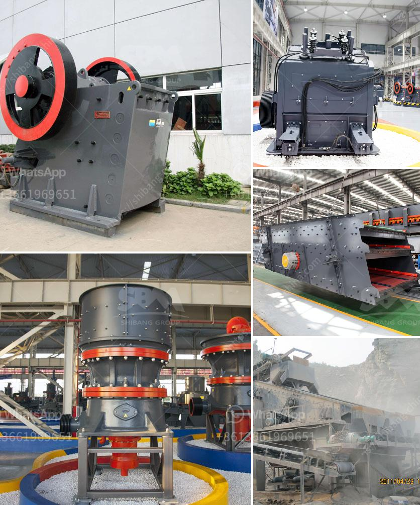

<h3>magnesium sulfate production line equipment</h3>
Magnesium sulfate, also known as Epsom salt, is a versatile compound widely used in various industries, including agriculture, medicine, and cosmetics. To meet the growing demand for magnesium sulfate, manufacturers rely on advanced production line equipment that ensures efficient and high-quality production processes.

The production line equipment for magnesium sulfate typically includes a series of interconnected machines that facilitate the various stages of production. It starts with the raw materials, primarily magnesium oxide and sulfuric acid, which are carefully selected for their purity and quality.

The first step in the production line is the mixing of magnesium oxide and sulfuric acid in a reactor. The reactor plays a crucial role in facilitating the chemical reaction between the two compounds, resulting in the formation of magnesium sulfate. This reaction requires precise control of temperature, pressure, and reaction time to ensure optimal yield and purity of the final product.

Once the reaction is complete, the mixture undergoes a filtration process to separate the liquid phase, which contains the dissolved magnesium sulfate, from the solid impurities. Filtration equipment, such as centrifuges or filter presses, are commonly used in this stage to achieve efficient separation.

The liquid phase containing the dissolved magnesium sulfate then enters the evaporation stage. Evaporation equipment, such as evaporators or crystallizers, are utilized to remove the excess water from the solution. This reduces the volume and increases the concentration of magnesium sulfate, resulting in the formation of solid crystals.

To achieve the desired crystal size and purity, the concentrated solution undergoes a controlled cooling process. Cooling equipment, such as cooling crystallizers or fluidized bed coolers, are commonly used in this stage. The precise control of cooling rates and temperatures plays a crucial role in determining the final crystal properties.

Once the crystals are formed, they are then separated from the mother liquor through a separation process. Centrifuges or filter presses are commonly used to achieve efficient separation of the solid crystals from the remaining solution.

The final step in the production line involves drying the separated crystals to remove any remaining moisture. Drying equipment, such as fluidized bed dryers or rotary dryers, are used to achieve the desired moisture content and stability of the final product.

In addition to the individual machines, the production line may also include various auxiliary equipment, such as pumps, conveyors, and storage tanks, to facilitate the smooth transfer of materials between different stages of the process.

Overall, the production line equipment for magnesium sulfate plays a critical role in ensuring efficient and high-quality production processes. By utilizing advanced technologies and precise control systems, manufacturers can meet the growing demand for magnesium sulfate and deliver products that meet the stringent requirements of various industries.
<h3>Contact us</h3><ul><li><strong>Whatsapp:&nbsp;<a href="https://wa.me/8613661969651">+8613661969651</a></strong></li><li><a href="https://swt.shibang-china.com/?git&amp;zhl&amp;magnesium sulfate production line equipment"><strong>Online Service(chat now)</strong></a></li></ul><h3>Related</h3><ul><li><a href='stone crusher in subic.md'>stone crusher in subic</a></li><li><a href='business plan on how to start a small scale quarry plant.md'>business plan on how to start a small scale quarry plant</a></li><li><a href='limestone powder mill in bankura.md'>limestone powder mill in bankura</a></li><li><a href='south africa manganese ore jaw crusher south africa.md'>south africa manganese ore jaw crusher south africa</a></li><li><a href='biggest jaw crusher in the world.md'>biggest jaw crusher in the world</a></li></ul>