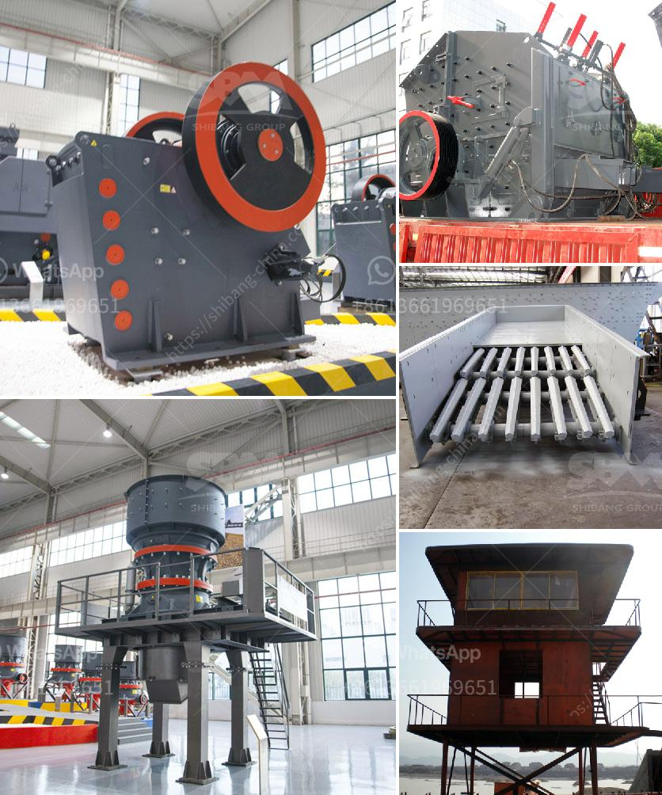

<h3>maize grinding mill in philippines south africa</h3>
Maize grinding mill machines have long been sought after tools in the agricultural sector. In the Philippines and South Africa, maize grinding mills are specifically designed to grind maize into fine powder. This grain ensures a consistent nutritional profile and is superior in taste and texture compared to other grains available in the market.

Maize, also known as corn, is a staple food for many communities around the world. It is rich in essential nutrients such as carbohydrates, protein, vitamins, and minerals. Maize is also versatile and can be used in various forms, including maize flour, maize meal, and maize grits. Grinding mills play a crucial role in processing maize into different forms, making it more accessible and convenient for consumers.

One of the primary advantages of using maize grinding mills in the Philippines and South Africa is their contribution to the local economy. These mills are often operated by small-scale farmers who process their own maize crops. By grinding maize into fine powder, farmers can sell their products directly to consumers, eliminating the need for intermediaries and increasing their profit margins. This direct market approach empowers farmers and encourages agricultural entrepreneurship.

Additionally, maize grinding mills promote food security by reducing dependency on imported maize products. In many developing countries, such as the Philippines and South Africa, importing maize from other countries can be expensive due to fluctuating prices and transportation costs. The availability of locally produced maize flour and meal not only lowers the cost for consumers but also strengthens the food supply chain within the country.

Furthermore, the use of maize grinding mills contributes to sustainable farming practices. These mills are typically operated manually or with the help of traditional machinery, which reduces the reliance on fossil fuels and lowers carbon emissions. Additionally, small-scale farmers who use these mills often practice organic and natural farming methods, making their maize products pesticide-free and environmentally friendly.

Maize grinding mills also support the preservation of cultural heritage. In many communities, grinding maize by hand or using traditional milling techniques is deeply ingrained in their cultural practices. However, with the introduction of modern machinery, these traditional practices are gradually fading away. By utilizing modern maize grinding mills that are designed to resemble traditional methods, communities can preserve their cultural identity while also benefiting from increased efficiency and productivity.

In conclusion, maize grinding mills have become an essential tool in the agricultural sector of the Philippines and South Africa. These machines not only boost the economic growth of local farmers but also contribute to food security, sustainability, and cultural preservation. The demand for maize products continues to rise, making the investment in maize grinding mills a wise choice for agricultural development.
<h3>Contact us</h3><ul><li><strong>Whatsapp:&nbsp;<a href="https://wa.me/8613661969651">+8613661969651</a></strong></li><li><a href="https://swt.shibang-china.com/?git&amp;zhl&amp;maize grinding mill in philippines south africa"><strong>Online Service(chat now)</strong></a></li></ul><h3>Related</h3><ul><li><a href='quarry equipment leasing companies in nigeria.md'>quarry equipment leasing companies in nigeria</a></li><li><a href='harga jaw crusher 400x600.md'>harga jaw crusher 400x600</a></li><li><a href='aggregate crushing plant and processing.md'>aggregate crushing plant and processing</a></li><li><a href='dental stone jaw crusher.md'>dental stone jaw crusher</a></li><li><a href='limestone ore processing plant.md'>limestone ore processing plant</a></li></ul>